# 16 - Thiết kế cơ sở dữ liệu MongoDB cho hệ thống quản lý từ thiện phân tán

Tài liệu này là bản Markdown đã được chuẩn hóa theo file preview `mermail.html`. File Mermaid/HTML được xem là nguồn mô tả sơ đồ chuẩn; tài liệu Markdown chỉ diễn giải lại thiết kế CSDL, giữ đúng tên sơ đồ, mô tả, thứ tự và nội dung kỹ thuật liên quan.

Phạm vi tài liệu là thiết kế cơ sở dữ liệu MongoDB và kiến trúc dữ liệu cho hệ thống quản lý từ thiện phân tán. Tài liệu không yêu cầu sửa code backend.

Nguồn sơ đồ chuẩn đi kèm tài liệu:

- File preview tổng hợp: `huong-dan/Thiết kế csdl/mermail.html`.
- Thư mục Mermaid nguồn: `huong-dan/Thiết kế csdl/mermail/`.
- Mọi sơ đồ `.mmd` trong thư mục `mermail/` phải đồng bộ 1-1 với source đang được render trong `mermail.html`.

Các nhãn chính của bộ sơ đồ: `Document model`, `Aggregate root`, `Embedded / Reference / Snapshot`, `Branch scope + RBAC`, `5 shard MongoDB ngang hàng`.

---

## 0. Bối cảnh, phạm vi và nguyên tắc thiết kế

Qua cấu trúc source code hiện tại, dự án là monorepo Node.js với backend TypeScript/Express/Mongoose, frontend Vite/React và MongoDB làm cơ sở dữ liệu chính.

| Thành phần | Hiện trạng |
|---|---|
| Backend | TypeScript, Express, Mongoose |
| Frontend | Vite, React |
| Database | MongoDB |
| Auth | JWT, RBAC theo vai trò |
| Backend modules | `auth`, `branches`, `campaigns`, `donations`, `donors`, `beneficiaries`, `disbursements`, `volunteers`, `activity-logs`, `stats` |
| Kết nối DB | `MONGODB_URI` qua environment variable |
| Seed hiện có | Super admin, branch admin, staff, donor, branch, campaign, donation, beneficiary, disbursement, volunteer, activity log |

Các collection/model hiện tại đã có nền tảng tốt:

- `branches` quản lý trụ sở, chi nhánh, trung tâm.
- `users` quản lý tài khoản, vai trò, `branchId`.
- `campaigns` có `branchId`, `location`, `images`, `proofImages`, thống kê tiền `currentAmount`, `disbursedAmount`.
- `donations` có `branchId`, `campaignId`, `donorId`, `donorSnapshot`, `campaignSnapshot`.
- `beneficiaries` có `branchId`, `campaignId`, `location`, trạng thái xác minh.
- `disbursements` có `branchId`, `campaignId`, `beneficiaryId`, `proofs`.
- `activity_logs` ghi actor, action, entity, before/after.

Điểm cần cải tổ ở mức thiết kế:

- `donations` hiện mới thể hiện tốt quyên góp tiền, chưa đủ cho hiện vật, thuốc men, sách vở, dịch vụ và giờ công.
- `disbursements` hiện thiên về phát tiền, chưa đủ cho hỗ trợ hiện vật, dịch vụ hoặc hỗn hợp.
- `campaigns` hiện có `targetAmount`, `currentAmount`, `disbursedAmount`; cần mở rộng thành `goals`, `requiredResources`, `summaryStats`.
- `donors` nên được nâng nghĩa thành `contributors` để bao quát cá nhân, tổ chức, người đóng góp hiện vật, dịch vụ hoặc giờ công.
- Cần chuẩn hóa shard key, access frequency và branch scope để phù hợp CSDL phân tán.

Mục tiêu thiết kế:

> Hệ thống quản lý từ thiện có quản trị tập trung, quản trị theo chi nhánh/trung tâm và hỗ trợ nhiều loại đóng góp.

Nguyên tắc chính:

- Thiết kế theo aggregate/document, không bê nguyên bảng SQL sang nhiều collection nhỏ.
- Embed dữ liệu thường đọc cùng nhau và cùng vòng đời.
- Reference dữ liệu có vòng đời độc lập hoặc tăng trưởng lớn.
- Snapshot thông tin lịch sử trong giao dịch đầu vào/đầu ra để giảm `$lookup` và giữ đúng dữ liệu tại thời điểm phát sinh.
- Mọi dữ liệu nghiệp vụ thuộc chi nhánh phải có `branchId`.
- Không dùng `$lookup` như join mặc định; chỉ dùng cho báo cáo tổng hợp hoặc màn hình admin ít tần suất.
- Chuẩn bị cho sharding theo `branchId`, `campaignId` hoặc range/zone shard key tùy collection.

Quy ước tần suất truy cập:

| Ký hiệu | Ý nghĩa |
|---|---|
| `H` | High frequency, tần suất cao |
| `M` | Medium frequency, tần suất trung bình |
| `L` | Low frequency, tần suất thấp |
| `R` | Read, đọc/xem/tìm kiếm |
| `W` | Write, tạo mới |
| `E` | Edit, cập nhật |
| `D` | Delete/Disable/Cancel, xóa mềm, khóa, hủy |

Ví dụ: `H.R` là đọc tần suất cao; `H.WER` là tạo, sửa, đọc tần suất cao; `L.WED` là tạo, sửa, hủy/xóa mềm tần suất thấp.

---

## Danh mục 17 sơ đồ chuẩn từ `mermail.html`

| STT | Tên sơ đồ trong `mermail.html` | File Mermaid | Mô tả chuẩn |
|---:|---|---|---|
| 01 | 01. Topology 5 shard MongoDB ngang hàng | `mermail/01-kien-truc-trung-tam-4-shard.mmd` | Mô tả M1 chạy mongos + config metadata, còn M2-M6 là 5 shard replica set ngang hàng; balancer phân bổ chunk theo shard key. |
| 02 | 02. Sơ đồ collection và aggregate root | `mermail/02-so-do-collection-aggregate-root.mmd` | Bản đồ các collection chính, cách reference bằng ObjectId và vai trò aggregate root trong mô hình tài liệu MongoDB. |
| 03 | 03. Nguyên tắc embed, reference và snapshot | `mermail/03-embedded-reference-snapshot.mmd` | Tóm tắt quyết định thiết kế quan trọng: embed dữ liệu cùng vòng đời, reference dữ liệu độc lập, snapshot dữ liệu lịch sử trong giao dịch. |
| 04 | 04. Tần suất truy cập theo scope dữ liệu | `mermail/04-tan-suat-truy-cap-hq-branch.mmd` | Sơ đồ hóa bảng tần suất truy cập, làm nổi bật collection tăng trưởng nhanh và trục branchId. |
| 05 | 05. Phân quyền RBAC và branch scope | `mermail/05-rbac-branch-scope.mmd` | Luồng backend áp filter dữ liệu theo vai trò, đảm bảo chi nhánh không đọc/sửa dữ liệu của chi nhánh khác. |
| 06 | 06. Document model của campaigns | `mermail/06-campaign-document-model.mmd` | Chiến dịch là aggregate root trung tâm, chứa mục tiêu, nguồn lực cần, thống kê tổng hợp và media/document đính kèm. |
| 07 | 07. Document model của contributions | `mermail/07-contribution-document-model.mmd` | Nguồn lực đầu vào mở rộng từ donation tiền sang tiền, hiện vật, thuốc, sách, dịch vụ và giờ công. |
| 08 | 08. Document model của aid_distributions | `mermail/08-aid-distribution-document-model.mmd` | Nguồn lực đầu ra gồm phát tiền, trao hàng, thuốc, sách, dịch vụ hoặc hỗn hợp, có snapshot và proof. |
| 09 | 09. Luồng cập nhật nguồn lực đầu vào | `mermail/09-luong-contribution-dau-vao.mmd` | Luồng tạo/xác nhận contribution, build snapshot, cập nhật summaryStats và activity_logs trong transaction/session khi có replica set. |
| 10 | 10. Luồng cập nhật nguồn lực đầu ra | `mermail/10-luong-aid-distribution-dau-ra.mmd` | Luồng lập kế hoạch, approve, deliver và complete hỗ trợ, có kiểm soát nguồn lực và chống cộng thống kê lặp. |
| 11 | 11. State transition của contributions và delta thống kê | `mermail/11-state-contribution-summary-delta.mmd` | Trạng thái nguồn lực đầu vào và thời điểm cộng/trừ summaryStats để chống ghi nhận trùng. |
| 12 | 12. State transition của aid_distributions | `mermail/12-state-aid-distribution.mmd` | Trạng thái nguồn lực đầu ra từ kế hoạch đến hoàn tất, kèm audit log và cập nhật summaryStats khi COMPLETED. |
| 13 | 13. Sharding strategy cho 5 shard ngang hàng | `mermail/13-sharding-strategy-4-shard.mmd` | Sơ đồ shard key đề xuất, collection nên shard trong bản demo và cách range/zone shard key phân bổ dữ liệu. |
| 14 | 14. Index theo use case chính | `mermail/14-index-theo-use-case.mmd` | Các index quan trọng bám theo truy vấn public, branch admin, dashboard, lịch sử contributor, audit log và idempotency thanh toán. |
| 15 | 15. Toàn vẹn dữ liệu, transaction và audit | `mermail/15-toan-ven-du-lieu-audit-transaction.mmd` | Các chốt bảo vệ dữ liệu khi MongoDB không có foreign key như RDBMS: validate reference, branch scope, transaction/idempotency và audit log. |
| 16 | 16. API/module map sang collection MongoDB | `mermail/16-api-to-collection-map.mmd` | Ánh xạ các endpoint/module chính sang collection, bao gồm cách giữ API cũ donations/disbursements để tương thích. |
| 17 | 17. Dashboard và summaryStats denormalized | `mermail/17-dashboard-summary-stats.mmd` | Cách contributions và aid_distributions cập nhật summaryStats/stats_snapshots để dashboard không phải aggregate nặng liên tục. |

---

## 01. Topology 5 shard MongoDB ngang hàng

**Mô tả chuẩn trong `mermail.html`:** M1 giữ vai trò điều phối (mongos + config metadata), M2-M6 là 5 shard replica set ngang hàng và balancer phân bổ chunk theo shard key.

**File Mermaid chuẩn:** `mermail/01-kien-truc-trung-tam-4-shard.mmd`

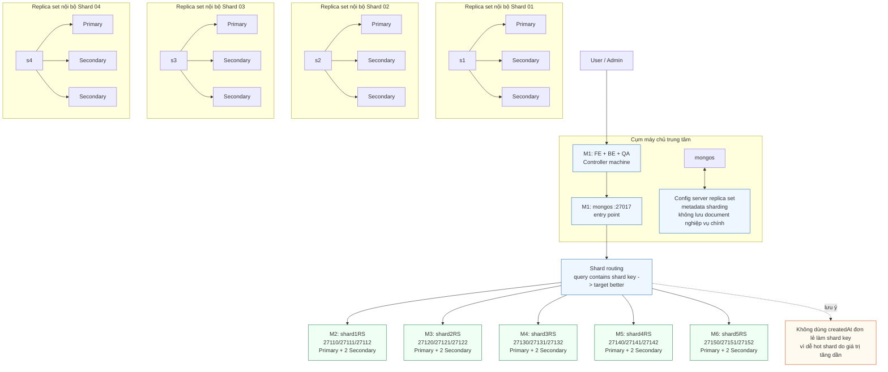


### Diễn giải thiết kế

Mô hình đề xuất gồm M1 là máy điều phối chạy FE/BE/QA và `mongos`; config server replica set giữ metadata sharding; M2-M6 là 5 shard replica set ngang hàng lưu dữ liệu sharded. Mỗi shard M2-M6 nhận chunk theo balancer dựa trên shard key và khối lượng dữ liệu thực tế.

```text
User/Admin
   |
   v
+--------------------------------------------------+
| M1: FE + BE + QA                                 |
+----------------------+---------------------------+
                       |
                       v
+--------------------------------------------------+     +-------------------------------------------------------+
|mongos :27017                                     |     | Config server replica set                             |
| Entry point cho ứng dụng và truy vấn MongoDB     | ->  | Lưu metadata sharding, không lưu dữ liệu nghiệp vụ    |
+--------------------------------------------------+     +-------------------------------------------------------+
                       |
                       v
               Shard routing qua mongos
                       |
       +---------------+---------------+---------------+---------------+
       |               |               |               |               |
       v               v               v               v               v
+-------------+ +-------------+ +-------------+ +-------------+ +-------------+
| M2 shard1RS | | M3 shard2RS | | M4 shard3RS | | M5 shard4RS | | M6 shard5RS |
| 3 node RS   | | 3 node RS   | | 3 node RS   | | 3 node RS   | | 3 node RS   |
+-------------+ +-------------+ +-------------+ +-------------+ +-------------+
```

---

## 02. Sơ đồ collection và aggregate root

**Mô tả chuẩn trong `mermail.html`:** Bản đồ các collection chính, cách reference bằng ObjectId và vai trò aggregate root trong mô hình tài liệu MongoDB.

**File Mermaid chuẩn:** `mermail/02-so-do-collection-aggregate-root.mmd`

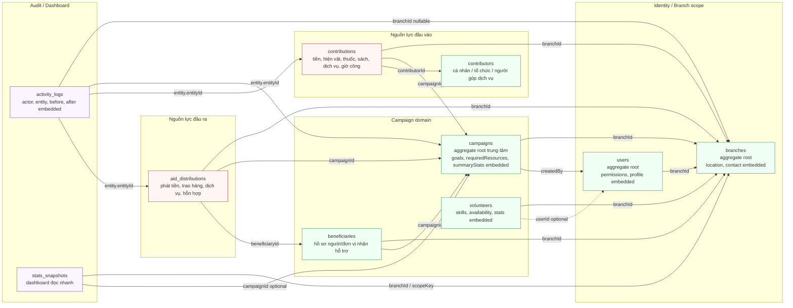


### Collection tổng quan

| Collection | Vai trò | Aggregate root | Tăng trưởng | Shard đề xuất |
|---|---|---:|---:|---|
| `branches` | Trụ sở, chi nhánh, trung tâm | Có | Thấp | Không cần shard |
| `users` | Tài khoản, vai trò, permission | Có | Trung bình | Chưa cần shard |
| `campaigns` | Chiến dịch từ thiện | Có | Trung bình | `branchId` hoặc `{ branchId, status }` |
| `contributors` | Contributor profiles | Yes | Medium | Not sharded in demo; can use range/zone shard when very large |
| `contributions` | Inbound resources | Yes | Very high | `{ branchId: 1 }` range-based, branch data placed on regional shard |
| `beneficiaries` | Người/đơn vị nhận hỗ trợ | Có | Cao | `branchId` hoặc `campaignId` |
| `aid_distributions` | Outbound resources | Yes | High | `{ branchId: 1 }` range-based, branch data placed on regional shard |
| `volunteers` | Hồ sơ tình nguyện viên | Có | Trung bình | `branchId` khi lớn |
| `activity_logs` | Audit logs | Yes | Very high | `{ branchId: 1 }` or `{ branchId: 1, createdAt: 1 }` |
| `stats_snapshots` | Dashboard snapshots | Yes | Medium | Not sharded in demo; can shard by `branchId` later |

### Quan hệ document tổng quát

```text
branches
  |- location {}
  |- contact {}

users
  |- branchId -> branches._id
  |- permissions []
  |- profile {}

campaigns
  |- branchId -> branches._id
  |- location {}
  |- timeRange {}
  |- goals {}
  |- requiredResources []
  |- summaryStats {}
  |- images []
  |- documents []

contributors
  |- userId -> users._id optional
  |- address {}
  |- totalContributionStats {}

contributions
  |- branchId -> branches._id
  |- campaignId -> campaigns._id
  |- contributorId -> contributors._id
  |- contributorSnapshot {}
  |- campaignSnapshot {}
  |- branchSnapshot {}
  |- moneyDetail {}
  |- itemDetails []
  |- serviceDetail {}
  |- volunteerWorkDetail {}
  |- proofs []

beneficiaries
  |- branchId -> branches._id
  |- campaignId -> campaigns._id
  |- address {}
  |- needs []
  |- verification {}
  |- documents []

aid_distributions
  |- branchId -> branches._id
  |- campaignId -> campaigns._id
  |- beneficiaryId -> beneficiaries._id
  |- beneficiarySnapshot {}
  |- campaignSnapshot {}
  |- branchSnapshot {}
  |- moneySupport {}
  |- itemSupports []
  |- serviceSupport {}
  |- proofs []

volunteers
  |- branchId -> branches._id
  |- userId -> users._id optional
  |- skills []
  |- availability []
  |- assignedCampaignIds []
  |- stats {}

activity_logs
  |- branchId -> branches._id
  |- actor {}
  |- entity {}
  |- metadata {}
  |- before {}
  |- after {}
```

Thiết kế này không tách quá nhỏ các bảng con như `campaign_images`, `contribution_items`, `proof_files`, `beneficiary_needs`. Những phần đó được embed vì thường đọc cùng document cha và không có vòng đời độc lập mạnh.

---

## 03. Nguyên tắc embed, reference và snapshot

**Mô tả chuẩn trong `mermail.html`:** Tóm tắt quyết định thiết kế quan trọng: embed dữ liệu cùng vòng đời, reference dữ liệu độc lập, snapshot dữ liệu lịch sử trong giao dịch.

**File Mermaid chuẩn:** `mermail/03-embedded-reference-snapshot.mmd`

```mermaid
flowchart TB
    rule["Nguyên tắc thiết kế MongoDB hướng tài liệu"]

    rule --> embed["Embed<br/>dữ liệu thường đọc cùng nhau<br/>và cùng vòng đời document cha"]
    rule --> ref["Reference<br/>đối tượng có vòng đời độc lập<br/>hoặc cần phân quyền/truy vấn riêng"]
    rule --> snap["Snapshot lịch sử<br/>giữ đúng ngữ cảnh tại thời điểm phát sinh<br/>giảm lookup khi xem lịch sử"]

    embed --> e1["campaigns.location<br/>campaigns.goals<br/>campaigns.requiredResources<br/>campaigns.summaryStats"]
    embed --> e2["contributions.moneyDetail<br/>contributions.itemDetails[]<br/>contributions.proofs[]"]
    embed --> e3["aid_distributions.moneySupport<br/>aid_distributions.itemSupports[]<br/>aid_distributions.proofs[]"]
    embed --> e4["activity_logs.actor<br/>activity_logs.entity<br/>activity_logs.before / after"]

    ref --> r1["branchId -> branches._id<br/>trục phân quyền, index, sharding"]
    ref --> r2["campaignId -> campaigns._id<br/>trục nghiệp vụ chiến dịch"]
    ref --> r3["contributorId -> contributors._id<br/>hồ sơ người/tổ chức đóng góp độc lập"]
    ref --> r4["beneficiaryId -> beneficiaries._id<br/>hồ sơ người nhận hỗ trợ độc lập"]
    ref --> r5["userId -> users._id optional<br/>khi contributor/volunteer có tài khoản"]

    snap --> s1["contributorSnapshot<br/>tên, phone, email, type lúc đóng góp"]
    snap --> s2["campaignSnapshot<br/>code, title lúc giao dịch"]
    snap --> s3["branchSnapshot<br/>code, name lúc giao dịch"]
    snap --> s4["beneficiarySnapshot<br/>name, type, phone, addressSummary lúc hỗ trợ"]

    conclusion["Kết quả: document giao dịch đủ thông tin để đọc lịch sử<br/>không dùng lookup như join mặc định"]
    embed --> conclusion
    ref --> conclusion
    snap --> conclusion

    classDef principle fill:#eef6ff,stroke:#2b6cb0,stroke-width:1px;
    classDef embedded fill:#f0fff4,stroke:#2f855a,stroke-width:1px;
    classDef reference fill:#fffaf0,stroke:#c05621,stroke-width:1px;
    classDef snapshot fill:#faf5ff,stroke:#6b46c1,stroke-width:1px;
    class rule,conclusion principle;
    class embed,e1,e2,e3,e4 embedded;
    class ref,r1,r2,r3,r4,r5 reference;
    class snap,s1,s2,s3,s4 snapshot;
```


### Embedded document

| Collection | Embedded field | Lý do |
|---|---|---|
| `branches` | `location`, `contact` | Đọc cùng branch, không có vòng đời riêng |
| `campaigns` | `location`, `goals`, `requiredResources`, `summaryStats`, `images`, `documents` | Chiến dịch là aggregate root; các phần này thường hiển thị cùng campaign |
| `contributions` | `moneyDetail`, `itemDetails`, `serviceDetail`, `volunteerWorkDetail`, `proofs` | Chi tiết đóng góp thuộc vòng đời contribution |
| `beneficiaries` | `address`, `needs`, `verification`, `documents` | Dữ liệu mô tả người nhận, thường đọc cùng hồ sơ |
| `aid_distributions` | `moneySupport`, `itemSupports`, `serviceSupport`, `proofs` | Chi tiết hỗ trợ thuộc vòng đời lần hỗ trợ |
| `volunteers` | `skills`, `availability`, `stats` | Thông tin hồ sơ tình nguyện viên |
| `activity_logs` | `actor`, `entity`, `metadata`, `before`, `after` | Log phải tự đủ ngữ cảnh, hạn chế lookup |

### Reference

| Reference | Lý do |
|---|---|
| `campaigns.branchId -> branches._id` | Branch có vòng đời riêng, phục vụ phân quyền và sharding |
| `users.branchId -> branches._id` | User thuộc chi nhánh |
| `contributions.branchId -> branches._id` | Lọc scope, dashboard, shard |
| `contributions.campaignId -> campaigns._id` | Contribution thuộc campaign |
| `contributions.contributorId -> contributors._id` | Contributor có hồ sơ độc lập |
| `beneficiaries.campaignId -> campaigns._id` | Người nhận theo chiến dịch |
| `aid_distributions.beneficiaryId -> beneficiaries._id` | Lần hỗ trợ tham chiếu hồ sơ người nhận |
| `volunteers.userId -> users._id` | Volunteer có thể có tài khoản đăng nhập |

### Snapshot lịch sử

| Collection | Snapshot | Mục đích |
|---|---|---|
| `contributions` | `contributorSnapshot` | Giữ tên, điện thoại, email, loại contributor tại thời điểm đóng góp |
| `contributions` | `campaignSnapshot` | Giữ mã/tên chiến dịch tại thời điểm đóng góp |
| `contributions` | `branchSnapshot` | Báo cáo lịch sử không lệ thuộc đổi tên chi nhánh |
| `aid_distributions` | `beneficiarySnapshot` | Giữ đúng người nhận tại thời điểm hỗ trợ |
| `aid_distributions` | `campaignSnapshot` | Giữ đúng chiến dịch tại thời điểm hỗ trợ |
| `aid_distributions` | `branchSnapshot` | Phục vụ audit và báo cáo |
| `activity_logs` | `actor`, `before`, `after` | Truy vết thao tác mà không cần join |

Snapshot là điểm quan trọng giúp MongoDB phát huy thế mạnh document: một document giao dịch đủ thông tin để hiển thị lịch sử mà không phải lookup liên tục.

---

## 04. Tần suất truy cập theo scope dữ liệu

**Mô tả chuẩn trong `mermail.html`:** Sơ đồ hóa bảng tần suất truy cập, làm nổi bật collection tăng trưởng nhanh và trục branchId.

**File Mermaid chuẩn:** `mermail/04-tan-suat-truy-cap-hq-branch.mmd`

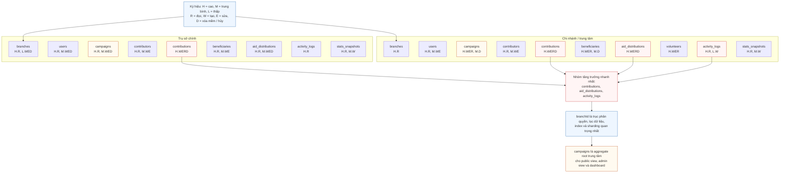


| Thực thể / collection | Trụ sở chính | Các chi nhánh / trung tâm | Ghi chú thiết kế |
|---|---|---|---|
| `branches` | `H.R, L.WED` | `H.R` | Super admin quản lý toàn hệ thống, branch chỉ đọc thông tin của mình |
| `users` | `H.R, M.WED` | `H.R, M.WE` | Branch admin tạo staff trong chi nhánh; không được sửa user branch khác |
| `campaigns` | `H.R, M.WED` | `H.WER, M.D` | Chi nhánh tạo và vận hành chiến dịch của mình |
| `contributors` | `H.R, M.WE` | `H.R, M.WE` | Tìm kiếm người/tổ chức đóng góp, cập nhật thống kê tổng |
| `contributions` | `H.WERD` | `H.WERD` | Collection tăng nhanh nhất ở đầu vào, cần shard/index tốt |
| `beneficiaries` | `H.R, M.WE` | `H.WER, M.D` | Chi nhánh xác minh người/đơn vị nhận hỗ trợ |
| `aid_distributions` | `H.R, M.WED` | `H.WERD` | Collection đầu ra, phải kiểm soát nguồn lực và audit |
| `volunteers` | `M.R, L.WE` | `H.WER` | Chi nhánh quản lý kỹ năng, lịch rảnh, gán campaign |
| `activity_logs` | `H.R` | `H.R, L.W` | Ghi tự động, đọc theo entity/branch/thời gian |
| `stats_snapshots` | `H.R, M.W` | `H.R, M.W` | Khuyến nghị mở rộng để dashboard nhanh hơn |

Kết luận từ bảng tần suất:

- `contributions`, `aid_distributions`, `activity_logs` là nhóm tăng trưởng nhanh nhất.
- `campaigns` là aggregate root trung tâm cho truy vấn người dùng và dashboard.
- `branchId` là trục phân quyền, lọc dữ liệu, index và sharding quan trọng nhất.
- Trụ sở chính đọc toàn hệ thống nhiều hơn ghi; chi nhánh ghi dữ liệu nghiệp vụ thường xuyên hơn.

---

## 05. Phân quyền RBAC và branch scope

**Mô tả chuẩn trong `mermail.html`:** Luồng backend áp filter dữ liệu theo vai trò, đảm bảo chi nhánh không đọc/sửa dữ liệu của chi nhánh khác.

**File Mermaid chuẩn:** `mermail/05-rbac-branch-scope.mmd`

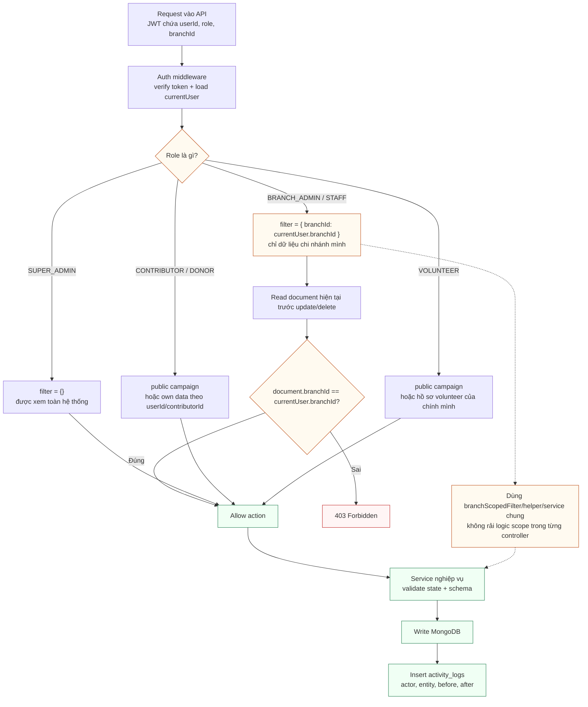


| Vai trò | Phạm vi dữ liệu | Quyền chính |
|---|---|---|
| `SUPER_ADMIN` | Toàn hệ thống | Quản lý branch, user admin, xem dashboard toàn hệ thống, audit toàn hệ thống |
| `BRANCH_ADMIN` | Chỉ `branchId` của mình | Quản lý campaign, staff, contributor, contribution, beneficiary, aid distribution của chi nhánh |
| `STAFF` | Chỉ `branchId` của mình | Thao tác nghiệp vụ theo permission được cấp |
| `CONTRIBUTOR/DONOR` | Public campaign và dữ liệu của chính mình | Tạo contribution, xem lịch sử cá nhân |
| `VOLUNTEER` | Public campaign và hồ sơ của mình | Đăng ký hỗ trợ, cập nhật kỹ năng/lịch rảnh |

Backend phải enforce branch scope tập trung:

```text
if user.role == SUPER_ADMIN:
    filter = {}
else if user.role in [BRANCH_ADMIN, STAFF]:
    filter = { branchId: currentUser.branchId }
else:
    filter = public data OR own data only
```

Quy tắc update/delete:

- Luôn đọc document hiện tại trước.
- Kiểm tra `document.branchId == currentUser.branchId`, trừ `SUPER_ADMIN`.
- Sai scope trả `403 Forbidden`.
- Không đặt logic branch filter rải rác trong controller; dùng middleware/helper/service dùng chung.

---

## 06. Document model của campaigns

**Mô tả chuẩn trong `mermail.html`:** Chiến dịch là aggregate root trung tâm, chứa mục tiêu, nguồn lực cần, thống kê tổng hợp và media/document đính kèm.

**File Mermaid chuẩn:** `mermail/06-campaign-document-model.mmd`

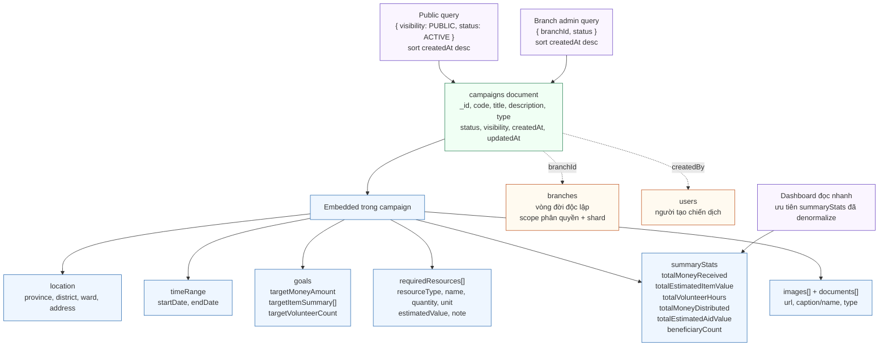


Ý nghĩa: `campaigns` là aggregate root trung tâm của chiến dịch từ thiện. Document này chứa mục tiêu, nguồn lực cần, thống kê tổng hợp và media/document đính kèm để màn hình public, admin và dashboard đọc nhanh.

```javascript
{
  _id: ObjectId,
  branchId: ObjectId,
  code: "HCM-FLOOD-2026",
  title: "Cứu trợ lũ lụt TP.HCM",
  description: "...",
  type: "FLOOD_RELIEF",
  status: "ACTIVE",
  visibility: "PUBLIC",
  location: {
    province: "TP.HCM",
    district: "Thủ Đức",
    ward: "Linh Trung",
    address: "..."
  },
  timeRange: {
    startDate: ISODate,
    endDate: ISODate
  },
  goals: {
    targetMoneyAmount: 100000000,
    targetItemSummary: [
      { name: "Gạo", quantity: 1000, unit: "kg" }
    ],
    targetVolunteerCount: 50
  },
  requiredResources: [
    {
      resourceType: "MONEY",
      name: "Tiền mặt",
      quantity: 100000000,
      unit: "VND",
      estimatedValue: 100000000,
      note: "Chi phí cứu trợ khẩn cấp"
    }
  ],
  summaryStats: {
    totalMoneyReceived: 0,
    totalEstimatedItemValue: 0,
    totalItemsReceived: 0,
    totalVolunteerHours: 0,
    totalMoneyDistributed: 0,
    totalEstimatedAidValue: 0,
    beneficiaryCount: 0
  },
  images: [{ url: "...", caption: "Ảnh khu vực hỗ trợ" }],
  documents: [{ url: "...", name: "Quyết định triển khai", type: "PDF" }],
  createdBy: ObjectId,
  createdAt: ISODate,
  updatedAt: ISODate
}
```

Embed trong `campaigns`:

- `location`, `timeRange`, `goals`, `requiredResources`.
- `summaryStats` để dashboard đọc nhanh.
- `images`, `documents` vì thường đọc cùng chiến dịch.

Reference:

- `branchId -> branches._id`.
- `createdBy -> users._id`.

Index đề xuất:

```javascript
db.campaigns.createIndex({ code: 1 }, { unique: true })
db.campaigns.createIndex({ branchId: 1, status: 1, createdAt: -1 })
db.campaigns.createIndex({ branchId: 1, type: 1, createdAt: -1 })
db.campaigns.createIndex({ visibility: 1, status: 1, createdAt: -1 })
db.campaigns.createIndex({ "location.province": 1, status: 1 })
```

---

## 07. Document model của contributions

**Mô tả chuẩn trong `mermail.html`:** Nguồn lực đầu vào mở rộng từ donation tiền sang tiền, hiện vật, thuốc, sách, dịch vụ và giờ công.

**File Mermaid chuẩn:** `mermail/07-contribution-document-model.mmd`

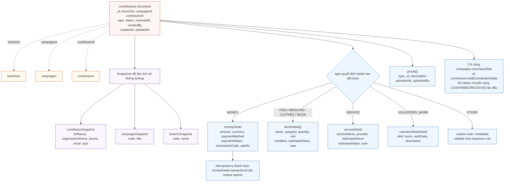


Ý nghĩa: `contributions` là nguồn lực đầu vào, thay thế tư duy `donation = money`. Một contribution có thể là tiền, hiện vật, thuốc men, quần áo, sách vở, dịch vụ, giờ công hoặc loại khác.

```javascript
{
  _id: ObjectId,
  branchId: ObjectId,
  campaignId: ObjectId,
  contributorId: ObjectId,
  type: "ITEM", // MONEY, ITEM, MEDICINE, CLOTHES, BOOK, SERVICE, VOLUNTEER_WORK, OTHER
  status: "RECEIVED", // PENDING, CONFIRMED, RECEIVED, CANCELLED, REJECTED, REFUNDED
  contributorSnapshot: {
    fullName: "Nguyen Van Hao",
    organizationName: null,
    phone: "0900000001",
    email: "hao@example.com",
    type: "INDIVIDUAL"
  },
  campaignSnapshot: {
    code: "HCM-FLOOD-2026",
    title: "Cứu trợ lũ lụt TP.HCM"
  },
  branchSnapshot: {
    code: "HCM",
    name: "Chi nhánh TP.HCM"
  },
  moneyDetail: null,
  itemDetails: [
    {
      name: "Gạo",
      category: "FOOD",
      quantity: 100,
      unit: "kg",
      condition: "NEW",
      estimatedValue: 1800000,
      note: "Đóng bao 5kg"
    }
  ],
  serviceDetail: null,
  volunteerWorkDetail: null,
  proofs: [
    {
      type: "IMAGE",
      url: "https://...",
      description: "Ảnh tiếp nhận",
      uploadedAt: ISODate,
      uploadedBy: ObjectId
    }
  ],
  receivedAt: ISODate,
  createdBy: ObjectId,
  createdAt: ISODate,
  updatedAt: ISODate
}
```

Ví dụ quyên góp tiền:

```javascript
{
  type: "MONEY",
  moneyDetail: {
    amount: 2500000,
    currency: "VND",
    paymentMethod: "BANK_TRANSFER",
    paymentStatus: "SUCCESS",
    transactionCode: "TXN-HCM-001",
    paidAt: ISODate
  }
}
```

Ví dụ đóng góp giờ công:

```javascript
{
  type: "VOLUNTEER_WORK",
  volunteerWorkDetail: {
    skill: "medical-support",
    hours: 6,
    workDate: ISODate,
    description: "Hỗ trợ phân loại thuốc"
  }
}
```

Validation bắt buộc:

- `type = MONEY`: `moneyDetail.amount > 0`.
- `type = ITEM/MEDICINE/CLOTHES/BOOK`: `itemDetails` có ít nhất 1 item, mỗi item `quantity > 0`.
- `type = SERVICE`: `serviceDetail` bắt buộc, `estimatedHours > 0` nếu có giờ.
- `type = VOLUNTEER_WORK`: `volunteerWorkDetail.hours > 0`.
- Không cộng `summaryStats` nếu status không chuyển mới sang `CONFIRMED` hoặc `RECEIVED`.
- `moneyDetail.transactionCode` phải unique/sparse để idempotency cho thanh toán.

Index đề xuất:

```javascript
db.contributions.createIndex({ branchId: 1, campaignId: 1, createdAt: -1 })
db.contributions.createIndex({ campaignId: 1, status: 1, createdAt: -1 })
db.contributions.createIndex({ contributorId: 1, createdAt: -1 })
db.contributions.createIndex({ branchId: 1, type: 1, status: 1, createdAt: -1 })
db.contributions.createIndex({ "moneyDetail.transactionCode": 1 }, { unique: true, sparse: true })
```

Shard đề xuất:

- Nếu truy vấn chính là admin chi nhánh: `{ branchId: 1 }`.
- Nếu truy vấn chính là theo chiến dịch: `{ campaignId: 1 }`.
- Nếu một chiến dịch quá lớn, cân nhắc bucket theo thời gian: `{ campaignId: 1, createdMonth: 1 }`.

---

## 08. Document model của aid_distributions

**Mô tả chuẩn trong `mermail.html`:** Nguồn lực đầu ra gồm phát tiền, trao hàng, thuốc, sách, dịch vụ hoặc hỗn hợp, có snapshot và proof.

**File Mermaid chuẩn:** `mermail/08-aid-distribution-document-model.mmd`

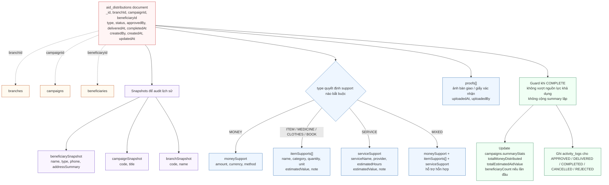


Ý nghĩa: `aid_distributions` là nguồn lực đầu ra, bao gồm phát tiền, trao hàng, trao thuốc, trao sách, hỗ trợ dịch vụ hoặc hỗn hợp.

```javascript
{
  _id: ObjectId,
  branchId: ObjectId,
  campaignId: ObjectId,
  beneficiaryId: ObjectId,
  type: "MIXED", // MONEY, ITEM, MEDICINE, CLOTHES, BOOK, SERVICE, MIXED, OTHER
  status: "COMPLETED", // PLANNED, APPROVED, DELIVERED, COMPLETED, CANCELLED, REJECTED
  beneficiarySnapshot: {
    name: "Hộ gia đình Trần",
    type: "FAMILY",
    phone: "0901231234",
    addressSummary: "Linh Trung, Thủ Đức, TP.HCM"
  },
  campaignSnapshot: {
    code: "HCM-FLOOD-2026",
    title: "Cứu trợ lũ lụt TP.HCM"
  },
  branchSnapshot: {
    code: "HCM",
    name: "Chi nhánh TP.HCM"
  },
  moneySupport: {
    amount: 1000000,
    currency: "VND",
    method: "CASH"
  },
  itemSupports: [
    {
      name: "Gạo",
      category: "FOOD",
      quantity: 20,
      unit: "kg",
      estimatedValue: 360000,
      note: "Trao trực tiếp"
    }
  ],
  serviceSupport: null,
  proofs: [
    {
      type: "IMAGE",
      url: "https://...",
      description: "Ảnh bàn giao",
      uploadedAt: ISODate,
      uploadedBy: ObjectId
    }
  ],
  approvedBy: ObjectId,
  approvedAt: ISODate,
  deliveredAt: ISODate,
  completedAt: ISODate,
  createdBy: ObjectId,
  createdAt: ISODate,
  updatedAt: ISODate
}
```

Validation:

- `type = MONEY`: `moneySupport.amount > 0`.
- `type = ITEM/MEDICINE/CLOTHES/BOOK/MIXED`: `itemSupports` phải hợp lệ.
- `type = SERVICE`: `serviceSupport` bắt buộc.
- Không cho `COMPLETED` nếu vượt nguồn lực khả dụng, nếu hệ thống bật kiểm soát tồn nguồn lực.
- Mọi thao tác `APPROVED`, `DELIVERED`, `COMPLETED`, `CANCELLED`, `REJECTED` phải ghi `activity_logs`.

Index đề xuất:

```javascript
db.aid_distributions.createIndex({ branchId: 1, campaignId: 1, status: 1, createdAt: -1 })
db.aid_distributions.createIndex({ branchId: 1, beneficiaryId: 1, status: 1 })
db.aid_distributions.createIndex({ campaignId: 1, completedAt: -1 })
db.aid_distributions.createIndex({ branchId: 1, type: 1, status: 1 })
```

---

## 09. Luồng cập nhật nguồn lực đầu vào

**Mô tả chuẩn trong `mermail.html`:** Luồng tạo/xác nhận contribution, build snapshot, cập nhật summaryStats và activity_logs trong transaction/session khi có replica set.

**File Mermaid chuẩn:** `mermail/09-luong-contribution-dau-vao.mmd`

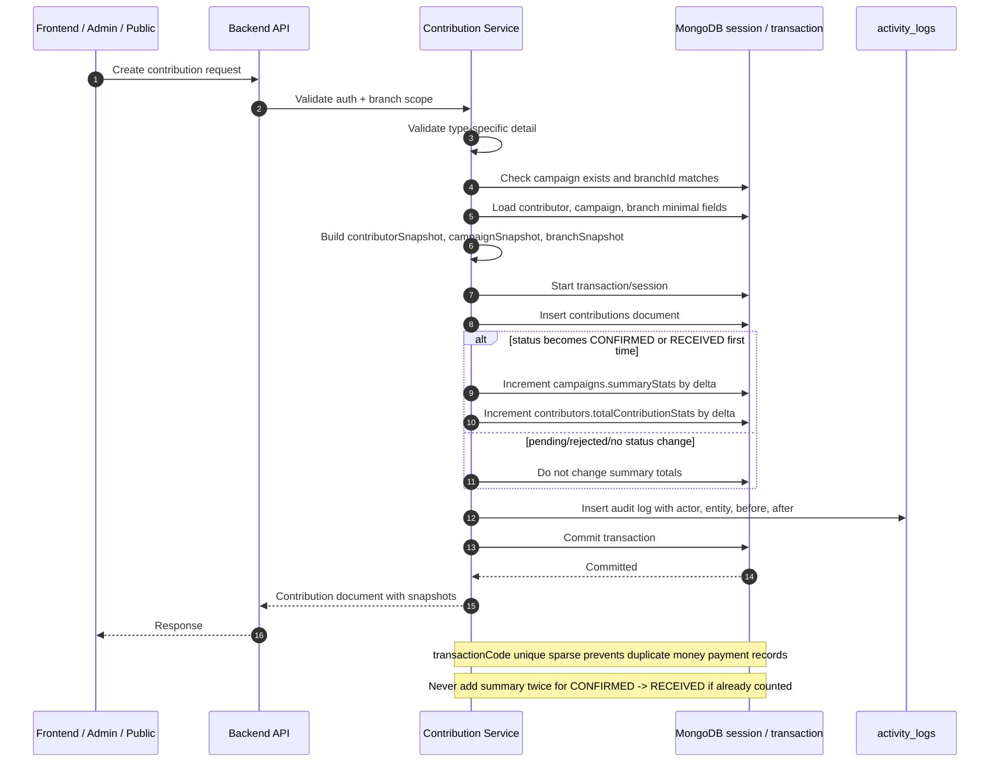


Quy tắc chống cộng lặp:

- Chỉ cộng summary khi trạng thái chuyển từ nhóm chưa ghi nhận sang nhóm đã ghi nhận.
- Nếu API gọi lại với cùng trạng thái, trả document hiện tại, không cộng lại.
- `transactionCode` unique/sparse cho quyên góp tiền.
- Khi rollback/refund/cancel từ trạng thái đã ghi nhận, trừ đúng delta đã cộng.

Delta đề xuất:

| Chuyển trạng thái | Tác động summary |
|---|---|
| `PENDING -> CONFIRMED/RECEIVED` | Cộng nguồn lực |
| `CONFIRMED -> RECEIVED` | Không cộng lại nếu đã cộng ở `CONFIRMED` |
| `RECEIVED -> CANCELLED/REFUNDED` | Trừ nguồn lực |
| `PENDING -> REJECTED` | Không cộng/trừ |
| Giữ nguyên trạng thái | Không cộng/trừ |

---

## 10. Luồng cập nhật nguồn lực đầu ra

**Mô tả chuẩn trong `mermail.html`:** Luồng lập kế hoạch, approve, deliver và complete hỗ trợ, có kiểm soát nguồn lực và chống cộng thống kê lặp.

**File Mermaid chuẩn:** `mermail/10-luong-aid-distribution-dau-ra.mmd`

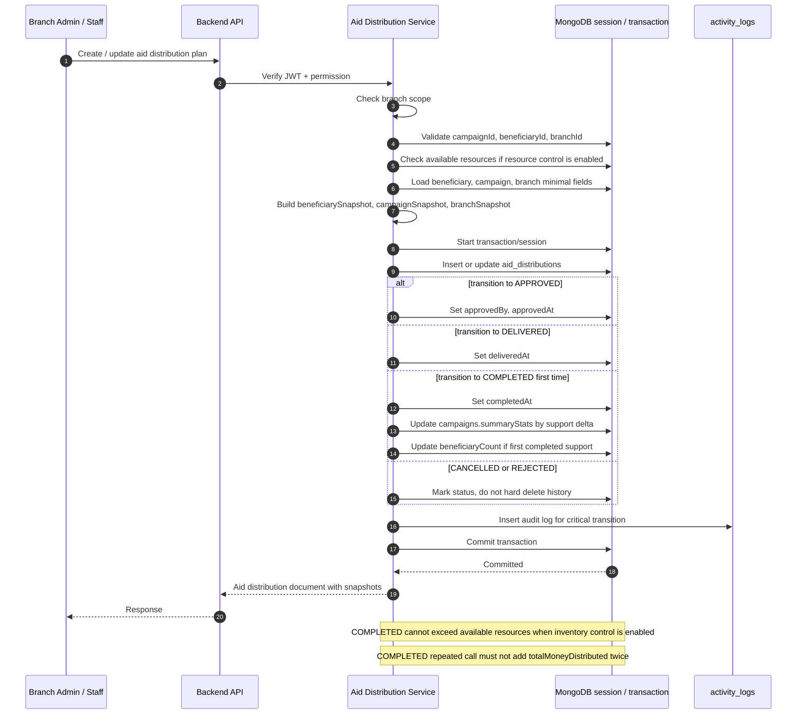


Quy tắc nghiệp vụ:

- `APPROVED` ghi `approvedBy`, `approvedAt`.
- `DELIVERED` ghi `deliveredAt`.
- `COMPLETED` ghi `completedAt` và cập nhật summary.
- Không cho `COMPLETED` lặp làm cộng lại `totalMoneyDistributed` hoặc `totalEstimatedAidValue`.
- Không xóa cứng dữ liệu tài chính/lịch sử; dùng `CANCELLED` hoặc `REJECTED`.

---

## 11. State transition của contributions và delta thống kê

**Mô tả chuẩn trong `mermail.html`:** Trạng thái nguồn lực đầu vào và thời điểm cộng/trừ summaryStats để chống ghi nhận trùng.

**File Mermaid chuẩn:** `mermail/11-state-contribution-summary-delta.mmd`

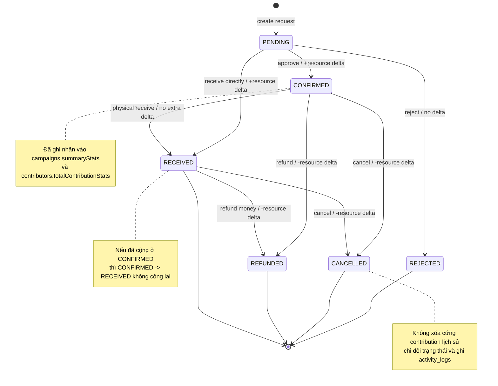


| Trạng thái nguồn | Trạng thái đích | Điều kiện | Tác động thống kê |
|---|---|---|---|
| `PENDING` | `CONFIRMED` | Admin/staff duyệt hợp lệ | Cộng resource delta |
| `PENDING` | `RECEIVED` | Nhận trực tiếp | Cộng resource delta |
| `PENDING` | `REJECTED` | Từ chối | Không cộng/trừ |
| `CONFIRMED` | `RECEIVED` | Nhận vật lý sau khi đã xác nhận | Không cộng lại |
| `CONFIRMED` | `CANCELLED` | Hủy sau khi đã ghi nhận | Trừ resource delta |
| `CONFIRMED` | `REFUNDED` | Hoàn tiền/hủy ghi nhận | Trừ resource delta |
| `RECEIVED` | `CANCELLED` | Hủy sau khi đã nhận | Trừ resource delta |
| `RECEIVED` | `REFUNDED` | Hoàn tiền | Trừ resource delta |

Nguyên tắc chính: chỉ cộng khi chuyển sang trạng thái ghi nhận lần đầu; chỉ trừ khi rời khỏi trạng thái đã ghi nhận; mọi thay đổi quan trọng phải ghi `activity_logs`.

---

## 12. State transition của aid_distributions

**Mô tả chuẩn trong `mermail.html`:** Trạng thái nguồn lực đầu ra từ kế hoạch đến hoàn tất, kèm audit log và cập nhật summaryStats khi COMPLETED.

**File Mermaid chuẩn:** `mermail/12-state-aid-distribution.mmd`

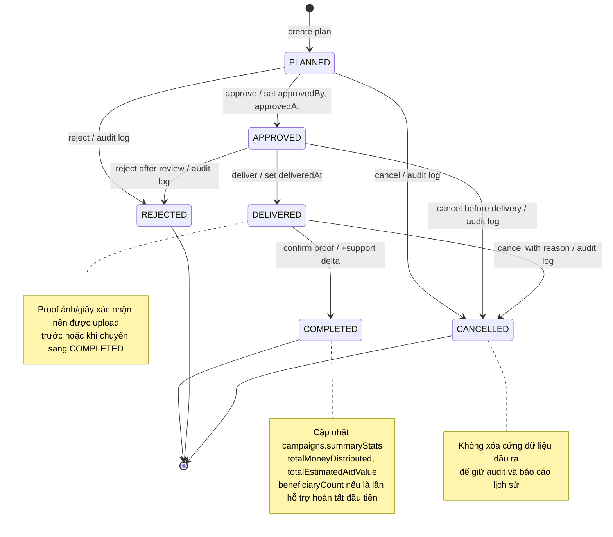


| Trạng thái nguồn | Trạng thái đích | Tác động |
|---|---|---|
| `PLANNED` | `APPROVED` | Ghi `approvedBy`, `approvedAt` |
| `PLANNED` | `REJECTED` | Ghi audit log, không xóa cứng |
| `PLANNED` | `CANCELLED` | Ghi audit log, không xóa cứng |
| `APPROVED` | `DELIVERED` | Ghi `deliveredAt` |
| `APPROVED` | `CANCELLED` | Hủy trước khi bàn giao, ghi audit log |
| `APPROVED` | `REJECTED` | Từ chối sau review, ghi audit log |
| `DELIVERED` | `COMPLETED` | Xác nhận proof, cộng support delta |
| `DELIVERED` | `CANCELLED` | Hủy có lý do, ghi audit log |

Nguyên tắc: chỉ khi chuyển sang `COMPLETED` lần đầu mới cập nhật `campaigns.summaryStats`. Nếu là lần hỗ trợ hoàn tất đầu tiên của một beneficiary trong campaign, cập nhật thêm `beneficiaryCount`.

---

## 13. Sharding strategy cho 5 shard ngang hàng

**Mô tả chuẩn trong `mermail.html`:** Sơ đồ shard key đề xuất, collection nên shard trong bản demo và cách range/zone shard key phân bổ dữ liệu.

**File Mermaid chuẩn:** `mermail/13-sharding-strategy-4-shard.mmd`

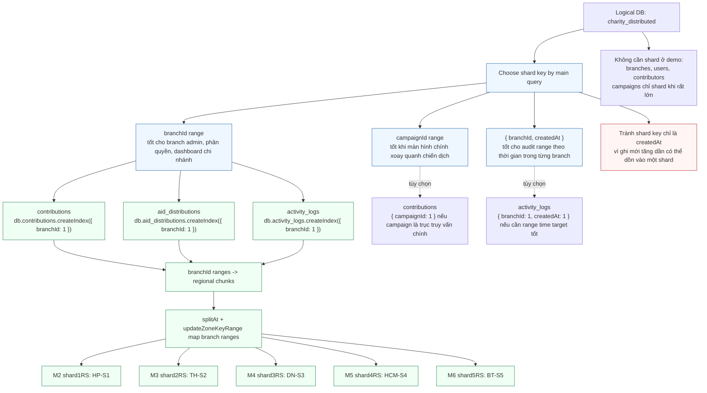


### Shard key đề xuất theo collection

| Collection | Shard key đề xuất | Khi dùng | Ưu điểm | Rủi ro |
|---|---|---|---|---|
| `campaigns` | `{ branchId: 1 }` | Số campaign rất lớn, quản trị theo branch là chính | Chia đều theo chi nhánh | Query theo status toàn hệ thống cần qua nhiều shard |
| `contributions` | `{ branchId: 1 }` | Branch admin là query chính | Phân quyền và route theo branch tốt | Một branch quá lớn vẫn có thể nặng |
| `contributions` | `{ campaignId: 1 }` | Campaign là query chính | Chia đều contribution theo campaign | Một campaign cực lớn có thể tạo điểm nóng logic |
| `aid_distributions` | `{ branchId: 1 }` | Quản lý đầu ra theo chi nhánh | Phù hợp branch scope | Báo cáo toàn hệ thống phải aggregate nhiều shard |
| `activity_logs` | `{ branchId: 1 }` | Audit theo chi nhánh | Phân phối đều hơn `createdAt` | Query theo khoảng thời gian toàn hệ thống scatter |
| `activity_logs` | `{ branchId: 1, createdAt: 1 }` | Cần range thời gian trong branch | Target tốt theo branch + time | Branch lớn có thể tạo chunk lớn |

Khuyến nghị cho bài báo cáo:

- Shard chính: `contributions`, `aid_distributions`, `activity_logs`.
- Shard key demo dễ giải thích: `{ branchId: 1 }`.
- Nếu nhóm muốn nhấn mạnh chiến dịch là trục nghiệp vụ: dùng `{ campaignId: 1 }` cho `contributions`.
- Không shard `branches`; chưa cần shard `users` và `contributors` ở bản demo.

Lệnh minh họa:

```javascript
sh.enableSharding("charity_distributed")

db.contributions.createIndex({ branchId: 1 })
sh.shardCollection("charity_distributed.contributions", { branchId: 1 })

db.aid_distributions.createIndex({ branchId: 1 })
sh.shardCollection("charity_distributed.aid_distributions", { branchId: 1 })

db.activity_logs.createIndex({ branchId: 1 })
sh.shardCollection("charity_distributed.activity_logs", { branchId: 1 })
```

---

## 14. Index theo use case chính

**Mô tả chuẩn trong `mermail.html`:** Các index quan trọng bám theo truy vấn public, branch admin, dashboard, lịch sử contributor, audit log và idempotency thanh toán.

**File Mermaid chuẩn:** `mermail/14-index-theo-use-case.mmd`

```mermaid
flowchart TB
    root["Index theo use case<br/>thiết kế index từ query thật, không tạo tùy tiện"]

    subgraph campaigns["campaigns"]
        c1["Public active campaigns<br/>{ visibility: 1, status: 1, createdAt: -1 }"]
        c2["Branch admin list<br/>{ branchId: 1, status: 1, createdAt: -1 }"]
        c3["Dashboard theo loại<br/>{ branchId: 1, type: 1, createdAt: -1 }"]
        c4["Search địa phương<br/>{ location.province: 1, status: 1 }"]
    end

    subgraph contributions["contributions"]
        ct1["Contribution theo campaign<br/>{ branchId: 1, campaignId: 1, createdAt: -1 }"]
        ct2["Duyệt pending<br/>{ campaignId: 1, status: 1, createdAt: -1 }"]
        ct3["Lịch sử contributor<br/>{ contributorId: 1, createdAt: -1 }"]
        ct4["Lọc type/status trong branch<br/>{ branchId: 1, type: 1, status: 1, createdAt: -1 }"]
        ct5["Idempotency thanh toán<br/>{ moneyDetail.transactionCode: 1 } unique sparse"]
    end

    subgraph beneficiaries["beneficiaries"]
        b1["Xác minh theo campaign<br/>{ branchId: 1, campaignId: 1, verification.status: 1 }"]
        b2["Theo tỉnh/thành<br/>{ address.province: 1 }"]
        b3["Tìm nhanh<br/>{ name: text, phone: text }"]
    end

    subgraph aid["aid_distributions"]
        a1["Đầu ra theo campaign<br/>{ branchId: 1, campaignId: 1, status: 1, createdAt: -1 }"]
        a2["Lịch sử hỗ trợ beneficiary<br/>{ branchId: 1, beneficiaryId: 1, status: 1 }"]
        a3["Báo cáo hoàn tất<br/>{ campaignId: 1, completedAt: -1 }"]
        a4["Lọc type/status<br/>{ branchId: 1, type: 1, status: 1 }"]
    end

    subgraph logs["activity_logs"]
        l1["Audit theo branch<br/>{ branchId: 1, createdAt: -1 }"]
        l2["Audit theo entity<br/>{ entity.entityType: 1, entity.entityId: 1, createdAt: -1 }"]
        l3["Audit theo actor<br/>{ actor.actorId: 1, createdAt: -1 }"]
    end

    root --> c1
    root --> ct1
    root --> b1
    root --> a1
    root --> l1

    classDef idx fill:#eef6ff,stroke:#2b6cb0,stroke-width:1px;
    classDef hot fill:#fff5f5,stroke:#c53030,stroke-width:1px;
    classDef rootcls fill:#f0fff4,stroke:#2f855a,stroke-width:1px;
    class root rootcls;
    class c1,c2,c3,c4,b1,b2,b3,a1,a2,a3,a4,l1,l2,l3 idx;
    class ct1,ct2,ct3,ct4,ct5 hot;
```


| Use case | Collection | Index đề xuất | Lý do |
|---|---|---|---|
| Public xem campaign đang hoạt động | `campaigns` | `{ visibility: 1, status: 1, createdAt: -1 }` | Lọc `PUBLIC/ACTIVE`, sort mới nhất |
| Branch admin xem campaign của chi nhánh | `campaigns` | `{ branchId: 1, status: 1, createdAt: -1 }` | Target query theo branch |
| Dashboard campaign theo loại | `campaigns` | `{ branchId: 1, type: 1, createdAt: -1 }` | Báo cáo chiến dịch theo loại |
| Admin xem contribution theo campaign | `contributions` | `{ branchId: 1, campaignId: 1, createdAt: -1 }` | Query thường xuyên nhất ở branch |
| Duyệt contribution pending | `contributions` | `{ campaignId: 1, status: 1, createdAt: -1 }` | Lọc hàng chờ xác nhận |
| Contributor xem lịch sử | `contributions` | `{ contributorId: 1, createdAt: -1 }` | Lịch sử cá nhân |
| Chống giao dịch tiền trùng | `contributions` | `{ "moneyDetail.transactionCode": 1 } unique sparse` | Idempotency |
| Tìm beneficiary theo campaign | `beneficiaries` | `{ branchId: 1, campaignId: 1, "verification.status": 1 }` | Chi nhánh xác minh người nhận |
| Xem hỗ trợ theo người nhận | `aid_distributions` | `{ branchId: 1, beneficiaryId: 1, status: 1 }` | Lịch sử hỗ trợ một beneficiary |
| Báo cáo đầu ra theo campaign | `aid_distributions` | `{ campaignId: 1, completedAt: -1 }` | Tổng hợp hỗ trợ đã hoàn tất |
| Log theo entity | `activity_logs` | `{ "entity.entityType": 1, "entity.entityId": 1, createdAt: -1 }` | Mở lịch sử thao tác của một document |
| Log theo chi nhánh | `activity_logs` | `{ branchId: 1, createdAt: -1 }` | Audit branch |

Nguyên tắc tạo index: thiết kế index từ query thật, ưu tiên các query tần suất cao, có lọc `branchId`, `campaignId`, `status` và sort theo thời gian. Không tạo index tùy tiện vì index làm tăng chi phí ghi với collection tăng trưởng nhanh.

---

## 15. Toàn vẹn dữ liệu, transaction và audit

**Mô tả chuẩn trong `mermail.html`:** Các chốt bảo vệ dữ liệu khi MongoDB không có foreign key như RDBMS: validate reference, branch scope, transaction/idempotency và audit log.

**File Mermaid chuẩn:** `mermail/15-toan-ven-du-lieu-audit-transaction.mmd`

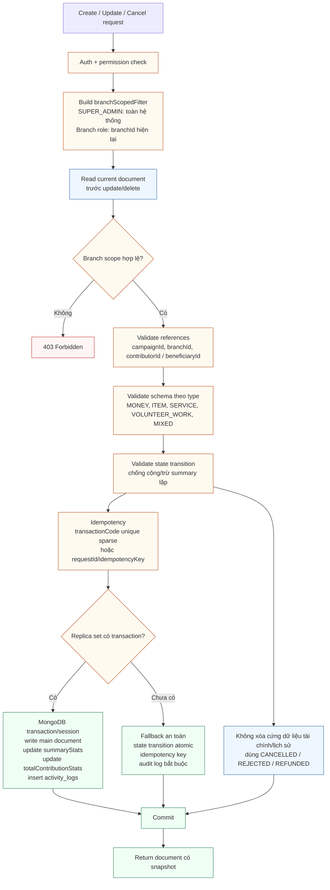


MongoDB không có foreign key như RDBMS, vì vậy backend phải bảo vệ toàn vẹn bằng service logic:

- Trước khi tạo contribution, kiểm tra `campaignId`, `contributorId`, `branchId`.
- Trước khi tạo aid distribution, kiểm tra `campaignId`, `beneficiaryId`, `branchId`.
- Trước update/delete, kiểm tra branch scope.
- Dùng transaction nếu MongoDB chạy replica set.
- Nếu chưa có replica set, dùng idempotency key và state transition để tránh cộng/trừ lặp.
- Không xóa cứng contribution/aid distribution đã ghi nhận; dùng trạng thái hủy/hoàn/từ chối.
- Ghi `activity_logs` cho thao tác quan trọng.
- Dùng validator Mongoose/Zod theo từng `type`.

| Yêu cầu | Cách thiết kế đáp ứng |
|---|---|
| Document model | `campaigns`, `contributions`, `aid_distributions` là aggregate root rõ ràng |
| Embedded document | Chi tiết tiền, hiện vật, proof, location, summary được embed |
| Schema linh hoạt | `contributions.type` quyết định detail tương ứng |
| Dữ liệu lồng nhau | `itemDetails[]`, `requiredResources[]`, `proofs[]`, `needs[]` |
| Snapshot lịch sử | `contributorSnapshot`, `campaignSnapshot`, `beneficiarySnapshot` |
| Hạn chế join | Màn hình lịch sử contribution/aid có đủ thông tin snapshot |
| Dashboard nhanh | `campaigns.summaryStats` denormalized |
| Phân tán theo chi nhánh | Mọi collection nghiệp vụ có `branchId` |
| Sharding | Collection tăng nhanh có shard key phù hợp |
| Audit minh bạch | `activity_logs` tự đủ ngữ cảnh actor/entity/before/after |

Thiết kế này không xem MongoDB như RDBMS trá hình. Các dữ liệu thuộc vòng đời document cha được embed, còn reference chỉ dùng khi đối tượng có vòng đời riêng hoặc cần phân quyền/truy vấn độc lập.

---

## 16. API/module map sang collection MongoDB

**Mô tả chuẩn trong `mermail.html`:** Ánh xạ các endpoint/module chính sang collection, bao gồm cách giữ API cũ donations/disbursements để tương thích.

**File Mermaid chuẩn:** `mermail/16-api-to-collection-map.mmd`

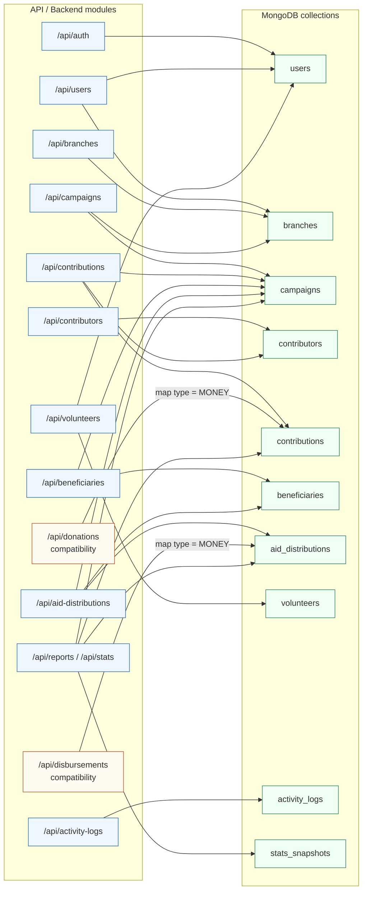


| Nhóm API | Endpoint gợi ý | Collection chính | Ghi chú |
|---|---|---|---|
| Auth | `/api/auth` | `users` | Login, JWT, profile |
| Users | `/api/users` | `users`, `branches` | Tạo branch admin/staff, khóa tài khoản |
| Branches | `/api/branches` | `branches` | Super admin quản lý, branch admin đọc branch của mình |
| Campaigns | `/api/campaigns` | `campaigns`, `branches` | CRUD, public active campaigns, dashboard summary |
| Contributors | `/api/contributors` | `contributors` | Tạo/cập nhật/tìm kiếm, lịch sử đóng góp |
| Contributions | `/api/contributions` | `contributions`, `campaigns`, `contributors` | Tạo MONEY/ITEM/SERVICE/VOLUNTEER_WORK, confirm, reject, refund |
| Donations compatibility | `/api/donations` | `contributions` | Giữ API cũ, map sang `type = MONEY` |
| Beneficiaries | `/api/beneficiaries` | `beneficiaries`, `campaigns` | Tạo/cập nhật/xác minh theo campaign/branch |
| Aid distributions | `/api/aid-distributions` | `aid_distributions`, `beneficiaries`, `campaigns` | Lập kế hoạch, approve, deliver, complete, proof |
| Disbursements compatibility | `/api/disbursements` | `aid_distributions` | Giữ API cũ, map sang `type = MONEY` |
| Volunteers | `/api/volunteers` | `volunteers`, `users` | Đăng ký, skill, availability, gán campaign |
| Activity logs | `/api/activity-logs` | `activity_logs` | Xem theo entity, branch, actor |
| Reports/Stats | `/api/reports`, `/api/stats` | `campaigns`, `contributions`, `aid_distributions`, `stats_snapshots` | Dashboard toàn hệ thống/chi nhánh/campaign |

### Đối chiếu với code hiện tại và hướng nâng cấp

| Hiện tại trong code | Thiết kế đề xuất | Hướng nâng cấp |
|---|---|---|
| `donors` | `contributors` | Đổi tên logic hoặc giữ collection cũ nhưng mở rộng ý nghĩa |
| `donations` chỉ tiền | `contributions` nhiều loại | Thêm `type`, `moneyDetail`, `itemDetails`, `serviceDetail`, `volunteerWorkDetail` |
| `disbursements` chỉ tiền | `aid_distributions` nhiều loại | Thêm `type`, `moneySupport`, `itemSupports`, `serviceSupport`, snapshot beneficiary |
| `campaigns.targetAmount/currentAmount/disbursedAmount` | `goals` và `summaryStats` | Giữ field cũ để tương thích, thêm field mới cho mở rộng |
| `activity_logs` field phẳng | `actor`, `entity`, `metadata` embedded | Có thể migrate dần, không bắt buộc đổi ngay |
| `branchScopedFilter` đã có | Giữ và mở rộng | Dùng chung cho mọi service nghiệp vụ |

Nếu không muốn phá API cũ:

- Giữ `/api/donations` nhưng map sang `contributions` với `type = MONEY`.
- Giữ `/api/disbursements` nhưng map sang `aid_distributions` với `type = MONEY`.
- API mới có thể là `/api/contributions` và `/api/aid-distributions`.

---

## 17. Dashboard và summaryStats denormalized

**Mô tả chuẩn trong `mermail.html`:** Cách contributions và aid_distributions cập nhật summaryStats/stats_snapshots để dashboard không phải aggregate nặng liên tục.

**File Mermaid chuẩn:** `mermail/17-dashboard-summary-stats.mmd`

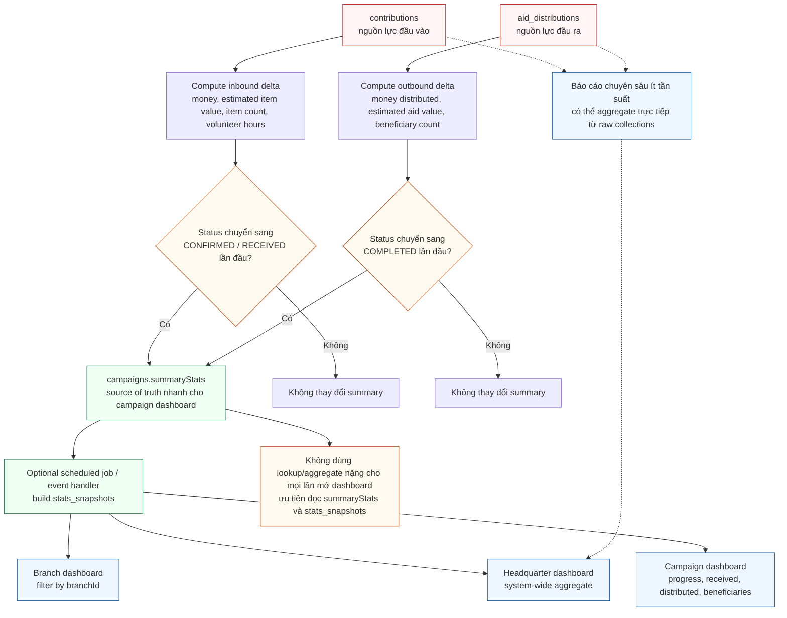


`campaigns.summaryStats` là nguồn đọc nhanh cho dashboard cấp campaign. `stats_snapshots` là lớp snapshot tùy chọn để dashboard cấp chi nhánh và trụ sở chính không phải aggregate nặng liên tục.

### Nguồn cập nhật `summaryStats`

| Nguồn | Điều kiện cập nhật | Chỉ số cập nhật |
|---|---|---|
| `contributions` | Status chuyển sang `CONFIRMED/RECEIVED` lần đầu | `totalMoneyReceived`, `totalEstimatedItemValue`, `totalItemsReceived`, `totalVolunteerHours` |
| `contributions` | Status chuyển từ đã ghi nhận sang `CANCELLED/REFUNDED` | Trừ đúng delta đã cộng |
| `aid_distributions` | Status chuyển sang `COMPLETED` lần đầu | `totalMoneyDistributed`, `totalEstimatedAidValue`, `beneficiaryCount` nếu là lần hỗ trợ đầu tiên |
| `aid_distributions` | Hủy/đảo trạng thái sau khi đã completed | Trừ đúng delta nếu nghiệp vụ cho phép đảo |

### `stats_snapshots` đề xuất

```javascript
{
  _id: ObjectId,
  scope: "BRANCH", // SYSTEM, BRANCH, CAMPAIGN
  scopeKey: "branch:<branchId>",
  branchId: ObjectId | null,
  campaignId: ObjectId | null,
  period: {
    type: "DAY", // DAY, WEEK, MONTH, YEAR, ALL_TIME
    from: ISODate,
    to: ISODate
  },
  metrics: {
    totalCampaigns: 0,
    activeCampaigns: 0,
    totalMoneyReceived: 0,
    totalEstimatedItemValue: 0,
    totalVolunteerHours: 0,
    totalMoneyDistributed: 0,
    totalEstimatedAidValue: 0,
    beneficiaryCount: 0,
    contributionCount: 0,
    aidDistributionCount: 0
  },
  builtAt: ISODate,
  createdAt: ISODate,
  updatedAt: ISODate
}
```

Index đề xuất:

```javascript
db.stats_snapshots.createIndex({ scope: 1, scopeKey: 1, "period.type": 1, "period.from": -1 })
db.stats_snapshots.createIndex({ branchId: 1, "period.type": 1, "period.from": -1 })
db.stats_snapshots.createIndex({ campaignId: 1, "period.type": 1, "period.from": -1 })
```

Nguyên tắc dashboard:

- Dashboard campaign ưu tiên đọc `campaigns.summaryStats`.
- Dashboard branch/headquarter ưu tiên đọc `stats_snapshots` đã dựng sẵn theo kỳ.
- Báo cáo chuyên sâu ít tần suất có thể aggregate trực tiếp từ raw collections.
- Không dùng lookup/aggregate nặng cho mọi lần mở dashboard.

---

## Phụ lục A. Thiết kế bổ sung các collection nền tảng

### A.1 `branches`

Ý nghĩa: lưu trụ sở chính, chi nhánh, trung tâm vùng.

```javascript
{
  _id: ObjectId,
  code: "HCM",
  name: "Chi nhánh TP.HCM",
  type: "BRANCH", // HEADQUARTER, BRANCH, REGIONAL_CENTER
  parentId: ObjectId | null,
  location: {
    province: "TP.HCM",
    district: "Thủ Đức",
    ward: "Linh Trung",
    address: "..."
  },
  contact: {
    phone: "0900000000",
    email: "hcm@charity.local"
  },
  status: "ACTIVE", // ACTIVE, INACTIVE, LOCKED
  createdAt: ISODate,
  updatedAt: ISODate
}
```

Index:

```javascript
db.branches.createIndex({ code: 1 }, { unique: true })
db.branches.createIndex({ status: 1 })
db.branches.createIndex({ "location.province": 1 })
```

Không cần shard vì số lượng chi nhánh nhỏ.

### A.2 `users`

Ý nghĩa: lưu tài khoản đăng nhập và phân quyền.

```javascript
{
  _id: ObjectId,
  fullName: "Nguyen Van A",
  email: "a@example.com",
  phone: "0900000001",
  passwordHash: "...",
  role: "BRANCH_ADMIN", // SUPER_ADMIN, BRANCH_ADMIN, STAFF, CONTRIBUTOR, VOLUNTEER
  branchId: ObjectId | null,
  permissions: ["campaign:create", "contribution:confirm"],
  status: "ACTIVE", // ACTIVE, LOCKED, DISABLED
  profile: {
    avatarUrl: "...",
    title: "Branch Manager"
  },
  lastLoginAt: ISODate,
  createdAt: ISODate,
  updatedAt: ISODate
}
```

Nguyên tắc:

- Không trả `passwordHash` ra response.
- `SUPER_ADMIN` có thể không bị giới hạn bởi `branchId`.
- `BRANCH_ADMIN` và `STAFF` bắt buộc có `branchId`.
- `permissions` dùng để giới hạn quyền chi tiết cho staff.

Index:

```javascript
db.users.createIndex({ email: 1 }, { unique: true })
db.users.createIndex({ phone: 1 }, { sparse: true })
db.users.createIndex({ role: 1 })
db.users.createIndex({ branchId: 1, role: 1 })
db.users.createIndex({ status: 1 })
```

### A.3 `contributors`

Ý nghĩa: thay thế cách hiểu hẹp `donors`, bao gồm cá nhân, tổ chức, người đóng góp hiện vật, dịch vụ hoặc giờ công.

```javascript
{
  _id: ObjectId,
  type: "INDIVIDUAL", // INDIVIDUAL, ORGANIZATION
  fullName: "Nguyen Van Hao",
  organizationName: null,
  phone: "0900000001",
  email: "hao@example.com",
  address: {
    province: "TP.HCM",
    district: "Thủ Đức",
    detail: "..."
  },
  identityInfo: {
    type: "OPTIONAL_MASKED",
    last4: "1234"
  },
  totalContributionStats: {
    totalMoney: 2500000,
    totalEstimatedItemValue: 0,
    totalVolunteerHours: 0,
    contributionCount: 1
  },
  userId: ObjectId | null,
  createdAt: ISODate,
  updatedAt: ISODate
}
```

Index:

```javascript
db.contributors.createIndex({ phone: 1 }, { sparse: true })
db.contributors.createIndex({ email: 1 }, { sparse: true })
db.contributors.createIndex({ type: 1 })
db.contributors.createIndex({ userId: 1 }, { sparse: true })
db.contributors.createIndex({ fullName: "text", organizationName: "text", email: "text", phone: "text" })
```

### A.4 `beneficiaries`

Ý nghĩa: người, hộ gia đình, tổ chức hoặc cộng đồng nhận hỗ trợ.

```javascript
{
  _id: ObjectId,
  branchId: ObjectId,
  campaignId: ObjectId,
  type: "FAMILY",
  name: "Hộ gia đình Trần",
  phone: "0901231234",
  address: {
    province: "TP.HCM",
    district: "Thủ Đức",
    ward: "Linh Trung",
    detail: "..."
  },
  situationDescription: "Bị ảnh hưởng bởi ngập lụt",
  needs: [
    {
      resourceType: "FOOD",
      name: "Gạo",
      quantity: 50,
      unit: "kg",
      estimatedValue: 900000,
      note: "Nhu cầu khẩn cấp 2 tuần"
    }
  ],
  verification: {
    status: "VERIFIED",
    verifiedBy: ObjectId,
    verifiedAt: ISODate,
    note: "Đã xác minh tại địa phương"
  },
  documents: [
    { type: "IMAGE", url: "...", description: "Giấy xác nhận" }
  ],
  createdAt: ISODate,
  updatedAt: ISODate
}
```

Index:

```javascript
db.beneficiaries.createIndex({ branchId: 1, campaignId: 1, "verification.status": 1 })
db.beneficiaries.createIndex({ "address.province": 1 })
db.beneficiaries.createIndex({ name: "text", phone: "text" })
```

### A.5 `volunteers`

```javascript
{
  _id: ObjectId,
  branchId: ObjectId,
  userId: ObjectId | null,
  fullName: "Le Thi Minh",
  phone: "0903123123",
  email: "volunteer@example.com",
  skills: ["logistics", "medical-support"],
  availability: [
    { dayOfWeek: "SATURDAY", timeRange: "08:00-17:00" }
  ],
  assignedCampaignIds: [ObjectId],
  stats: {
    totalHours: 24,
    completedActivities: 4
  },
  status: "ACTIVE",
  createdAt: ISODate,
  updatedAt: ISODate
}
```

Index:

```javascript
db.volunteers.createIndex({ branchId: 1, status: 1 })
db.volunteers.createIndex({ branchId: 1, skills: 1 })
db.volunteers.createIndex({ userId: 1 }, { sparse: true })
```

### A.6 `activity_logs`

```javascript
{
  _id: ObjectId,
  branchId: ObjectId | null,
  actor: {
    actorId: ObjectId,
    role: "BRANCH_ADMIN",
    branchId: ObjectId,
    fullName: "HCM Branch Admin"
  },
  action: "CONTRIBUTION_CONFIRMED",
  entity: {
    entityType: "contribution",
    entityId: ObjectId
  },
  description: "Contribution moved PENDING -> RECEIVED",
  metadata: {
    requestId: "...",
    source: "admin-api"
  },
  before: {},
  after: {},
  ipAddress: "127.0.0.1",
  userAgent: "...",
  createdAt: ISODate
}
```

Index:

```javascript
db.activity_logs.createIndex({ branchId: 1, createdAt: -1 })
db.activity_logs.createIndex({ "entity.entityType": 1, "entity.entityId": 1, createdAt: -1 })
db.activity_logs.createIndex({ "actor.actorId": 1, createdAt: -1 })
```

Shard đề xuất:

- `{ branchId: 1 }` nếu truy vấn chủ yếu theo chi nhánh.
- `{ branchId: 1, createdAt: 1 }` nếu muốn truy vấn range theo thời gian trong từng chi nhánh.
- Tránh chỉ dùng `{ createdAt: 1 }`.


### A.7 Bảng tổng hợp 

#### Sơ đồ

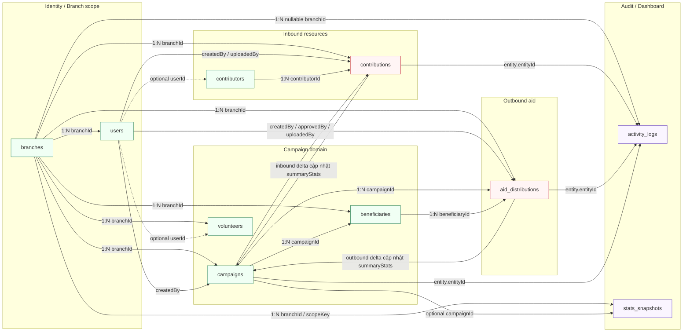

#### Thiết kế

```json
{
  "branches": {
    "_id": "ObjectId",
    "code": "string unique",
    "name": "string",
    "type": "HEADQUARTER|BRANCH|REGIONAL_CENTER",
    "parentId": "ObjectId|null",
    "location": {
      "province": "string",
      "district": "string",
      "ward": "string",
      "address": "string"
    },
    "contact": {
      "phone": "string",
      "email": "string"
    },
    "status": "ACTIVE|INACTIVE|LOCKED",
    "createdAt": "date",
    "updatedAt": "date"
  },
  "users": {
    "_id": "ObjectId",
    "fullName": "string",
    "email": "string unique",
    "phone": "string",
    "passwordHash": "string",
    "role": "SUPER_ADMIN|BRANCH_ADMIN|STAFF|CONTRIBUTOR|VOLUNTEER",
    "branchId": "ObjectId|null",
    "permissions": ["string"],
    "status": "ACTIVE|LOCKED|DISABLED",
    "profile": {
      "avatarUrl": "string",
      "title": "string"
    },
    "lastLoginAt": "date|null",
    "createdAt": "date",
    "updatedAt": "date"
  },
  "campaigns": {
    "_id": "ObjectId",
    "branchId": "ObjectId",
    "code": "string unique",
    "title": "string",
    "description": "string",
    "type": "FLOOD_RELIEF|MEDICAL|EDUCATION|FOOD_SUPPORT|OTHER",
    "status": "DRAFT|ACTIVE|PAUSED|COMPLETED|CANCELLED",
    "visibility": "PUBLIC|PRIVATE",
    "location": {
      "province": "string",
      "district": "string",
      "ward": "string",
      "address": "string"
    },
    "timeRange": {
      "startDate": "date",
      "endDate": "date|null"
    },
    "goals": {
      "targetMoneyAmount": "number",
      "targetItemSummary": [
        {
          "name": "string",
          "quantity": "number",
          "unit": "string"
        }
      ],
      "targetVolunteerCount": "number"
    },
    "requiredResources": [
      {
        "resourceType": "MONEY|FOOD|MEDICINE|CLOTHES|BOOK|SERVICE|VOLUNTEER_WORK|OTHER",
        "name": "string",
        "quantity": "number",
        "unit": "string",
        "estimatedValue": "number",
        "note": "string"
      }
    ],
    "summaryStats": {
      "totalMoneyReceived": "number",
      "totalEstimatedItemValue": "number",
      "totalItemsReceived": "number",
      "totalVolunteerHours": "number",
      "totalMoneyDistributed": "number",
      "totalEstimatedAidValue": "number",
      "beneficiaryCount": "number"
    },
    "images": [
      {
        "url": "string",
        "caption": "string"
      }
    ],
    "documents": [
      {
        "url": "string",
        "name": "string",
        "type": "string"
      }
    ],
    "createdBy": "ObjectId",
    "createdAt": "date",
    "updatedAt": "date"
  },
  "contributors": {
    "_id": "ObjectId",
    "type": "INDIVIDUAL|ORGANIZATION",
    "fullName": "string|null",
    "organizationName": "string|null",
    "phone": "string",
    "email": "string",
    "address": {
      "province": "string",
      "district": "string",
      "detail": "string"
    },
    "identityInfo": {
      "type": "OPTIONAL_MASKED",
      "last4": "string"
    },
    "totalContributionStats": {
      "totalMoney": "number",
      "totalEstimatedItemValue": "number",
      "totalVolunteerHours": "number",
      "contributionCount": "number"
    },
    "userId": "ObjectId|null",
    "createdAt": "date",
    "updatedAt": "date"
  },
  "contributions": {
    "_id": "ObjectId",
    "branchId": "ObjectId",
    "campaignId": "ObjectId",
    "contributorId": "ObjectId",
    "type": "MONEY|ITEM|MEDICINE|CLOTHES|BOOK|SERVICE|VOLUNTEER_WORK|OTHER",
    "status": "PENDING|CONFIRMED|RECEIVED|CANCELLED|REJECTED|REFUNDED",
    "contributorSnapshot": {
      "fullName": "string|null",
      "organizationName": "string|null",
      "phone": "string",
      "email": "string",
      "type": "INDIVIDUAL|ORGANIZATION"
    },
    "campaignSnapshot": {
      "code": "string",
      "title": "string"
    },
    "branchSnapshot": {
      "code": "string",
      "name": "string"
    },
    "moneyDetail": {
      "amount": "number",
      "currency": "VND",
      "paymentMethod": "CASH|BANK_TRANSFER|ONLINE_GATEWAY|OTHER",
      "paymentStatus": "PENDING|SUCCESS|FAILED|REFUNDED",
      "transactionCode": "string unique sparse",
      "paidAt": "date|null"
    },
    "itemDetails": [
      {
        "name": "string",
        "category": "FOOD|MEDICINE|CLOTHES|BOOK|OTHER",
        "quantity": "number",
        "unit": "string",
        "condition": "NEW|USED|EXPIRED_CHECKED|OTHER",
        "estimatedValue": "number",
        "note": "string"
      }
    ],
    "serviceDetail": {
      "serviceName": "string",
      "provider": "string",
      "estimatedHours": "number",
      "estimatedValue": "number",
      "note": "string"
    },
    "volunteerWorkDetail": {
      "skill": "string",
      "hours": "number",
      "workDate": "date",
      "description": "string"
    },
    "proofs": [
      {
        "type": "IMAGE|PDF|RECEIPT|OTHER",
        "url": "string",
        "description": "string",
        "uploadedAt": "date",
        "uploadedBy": "ObjectId"
      }
    ],
    "receivedAt": "date|null",
    "createdBy": "ObjectId",
    "createdAt": "date",
    "updatedAt": "date"
  },
  "beneficiaries": {
    "_id": "ObjectId",
    "branchId": "ObjectId",
    "campaignId": "ObjectId",
    "type": "PERSON|FAMILY|ORGANIZATION|COMMUNITY",
    "name": "string",
    "phone": "string",
    "address": {
      "province": "string",
      "district": "string",
      "ward": "string",
      "detail": "string"
    },
    "situationDescription": "string",
    "needs": [
      {
        "resourceType": "MONEY|FOOD|MEDICINE|CLOTHES|BOOK|SERVICE|OTHER",
        "name": "string",
        "quantity": "number",
        "unit": "string",
        "estimatedValue": "number",
        "note": "string"
      }
    ],
    "verification": {
      "status": "PENDING|VERIFIED|REJECTED",
      "verifiedBy": "ObjectId|null",
      "verifiedAt": "date|null",
      "note": "string"
    },
    "documents": [
      {
        "type": "IMAGE|PDF|OTHER",
        "url": "string",
        "description": "string"
      }
    ],
    "createdAt": "date",
    "updatedAt": "date"
  },
  "aid_distributions": {
    "_id": "ObjectId",
    "branchId": "ObjectId",
    "campaignId": "ObjectId",
    "beneficiaryId": "ObjectId",
    "type": "MONEY|ITEM|MEDICINE|CLOTHES|BOOK|SERVICE|MIXED|OTHER",
    "status": "PLANNED|APPROVED|DELIVERED|COMPLETED|CANCELLED|REJECTED",
    "beneficiarySnapshot": {
      "name": "string",
      "type": "PERSON|FAMILY|ORGANIZATION|COMMUNITY",
      "phone": "string",
      "addressSummary": "string"
    },
    "campaignSnapshot": {
      "code": "string",
      "title": "string"
    },
    "branchSnapshot": {
      "code": "string",
      "name": "string"
    },
    "moneySupport": {
      "amount": "number",
      "currency": "VND",
      "method": "CASH|BANK_TRANSFER|OTHER"
    },
    "itemSupports": [
      {
        "name": "string",
        "category": "FOOD|MEDICINE|CLOTHES|BOOK|OTHER",
        "quantity": "number",
        "unit": "string",
        "estimatedValue": "number",
        "note": "string"
      }
    ],
    "serviceSupport": {
      "serviceName": "string",
      "provider": "string",
      "estimatedHours": "number",
      "estimatedValue": "number",
      "note": "string"
    },
    "proofs": [
      {
        "type": "IMAGE|PDF|CONFIRMATION|OTHER",
        "url": "string",
        "description": "string",
        "uploadedAt": "date",
        "uploadedBy": "ObjectId"
      }
    ],
    "approvedBy": "ObjectId|null",
    "approvedAt": "date|null",
    "deliveredAt": "date|null",
    "completedAt": "date|null",
    "createdBy": "ObjectId",
    "createdAt": "date",
    "updatedAt": "date"
  },
  "volunteers": {
    "_id": "ObjectId",
    "branchId": "ObjectId",
    "userId": "ObjectId|null",
    "fullName": "string",
    "phone": "string",
    "email": "string",
    "skills": ["string"],
    "availability": [
      {
        "dayOfWeek": "MONDAY|TUESDAY|WEDNESDAY|THURSDAY|FRIDAY|SATURDAY|SUNDAY",
        "timeRange": "string"
      }
    ],
    "assignedCampaignIds": ["ObjectId"],
    "stats": {
      "totalHours": "number",
      "completedActivities": "number"
    },
    "status": "ACTIVE|INACTIVE|LOCKED",
    "createdAt": "date",
    "updatedAt": "date"
  },
  "activity_logs": {
    "_id": "ObjectId",
    "branchId": "ObjectId|null",
    "actor": {
      "actorId": "ObjectId",
      "role": "string",
      "branchId": "ObjectId|null",
      "fullName": "string"
    },
    "action": "string",
    "entity": {
      "entityType": "branch|user|campaign|contributor|contribution|beneficiary|aid_distribution|volunteer",
      "entityId": "ObjectId"
    },
    "description": "string",
    "metadata": {
      "requestId": "string",
      "source": "admin-api|public-api|system-job"
    },
    "before": {},
    "after": {},
    "ipAddress": "string",
    "userAgent": "string",
    "createdAt": "date"
  },
  "stats_snapshots": {
    "_id": "ObjectId",
    "scope": "SYSTEM|BRANCH|CAMPAIGN",
    "scopeKey": "string",
    "branchId": "ObjectId|null",
    "campaignId": "ObjectId|null",
    "period": {
      "type": "DAY|WEEK|MONTH|YEAR|ALL_TIME",
      "from": "date",
      "to": "date"
    },
    "metrics": {
      "totalCampaigns": "number",
      "activeCampaigns": "number",
      "totalMoneyReceived": "number",
      "totalEstimatedItemValue": "number",
      "totalVolunteerHours": "number",
      "totalMoneyDistributed": "number",
      "totalEstimatedAidValue": "number",
      "beneficiaryCount": "number",
      "contributionCount": "number",
      "aidDistributionCount": "number"
    },
    "builtAt": "date",
    "createdAt": "date",
    "updatedAt": "date"
  }
}
```

#### Bảng tóm tắt quan hệ và cách lưu

| Collection | Nhóm nghiệp vụ | Reference chính | Embedded/Snapshot chính | Ghi chú tạo bảng/collection |
|---|---|---|---|---|
| `branches` | Identity / Branch scope | `parentId` tự tham chiếu | `location`, `contact` | Không cần shard, là trục phân quyền cho dữ liệu nghiệp vụ |
| `users` | Identity / Branch scope | `branchId -> branches._id` | `profile`, `permissions` | `SUPER_ADMIN` có thể `branchId = null`; branch role bắt buộc có `branchId` |
| `campaigns` | Campaign domain | `branchId -> branches._id`, `createdBy -> users._id` | `location`, `timeRange`, `goals`, `requiredResources`, `summaryStats`, `images`, `documents` | Aggregate root trung tâm, dashboard ưu tiên đọc `summaryStats` |
| `contributors` | Inbound resources | `userId -> users._id` tùy chọn | `address`, `identityInfo`, `totalContributionStats` | Mở rộng từ donor để bao quát tiền, hiện vật, dịch vụ, giờ công |
| `contributions` | Inbound resources | `branchId`, `campaignId`, `contributorId`, `createdBy` | `contributorSnapshot`, `campaignSnapshot`, `branchSnapshot`, `moneyDetail`, `itemDetails`, `serviceDetail`, `volunteerWorkDetail`, `proofs` | Fast-growing collection; demo shards by `{ branchId: 1 }` so branch data goes to regional shard |
| `beneficiaries` | Campaign domain | `branchId`, `campaignId` | `address`, `needs`, `verification`, `documents` | Người/hộ/tổ chức/cộng đồng nhận hỗ trợ theo campaign |
| `aid_distributions` | Outbound aid | `branchId`, `campaignId`, `beneficiaryId`, `createdBy`, `approvedBy` | `beneficiarySnapshot`, `campaignSnapshot`, `branchSnapshot`, `moneySupport`, `itemSupports`, `serviceSupport`, `proofs` | Collection đầu ra; chỉ cộng `summaryStats` khi `COMPLETED` lần đầu |
| `volunteers` | Campaign domain | `branchId`, `userId` tùy chọn, `assignedCampaignIds[]` | `skills`, `availability`, `stats` | Quản lý kỹ năng, lịch rảnh và gán chiến dịch |
| `activity_logs` | Audit / Dashboard | `branchId`, `actor.actorId`, `entity.entityId` | `actor`, `entity`, `metadata`, `before`, `after` | Không xóa cứng; dùng để truy vết mọi thao tác quan trọng |
| `stats_snapshots` | Audit / Dashboard | `branchId`, `campaignId` tùy scope | `period`, `metrics` | Snapshot dashboard theo ngày/tuần/tháng/năm/all-time, giảm aggregate nặng |

#### Ghi chú chuẩn hóa khi triển khai collection

- Tất cả dữ liệu nghiệp vụ theo chi nhánh phải có `branchId`: `campaigns`, `contributions`, `beneficiaries`, `aid_distributions`, `volunteers`, `activity_logs`, `stats_snapshots`.
- `contributions` và `aid_distributions` bắt buộc lưu snapshot để xem lịch sử không phụ thuộc việc đổi tên campaign, branch, contributor hoặc beneficiary về sau.
- `campaigns.summaryStats` chỉ được cập nhật qua state transition hợp lệ để tránh cộng/trừ lặp.
- Các API cũ `/api/donations` và `/api/disbursements` vẫn có thể giữ tương thích bằng cách map sang `contributions.type = MONEY` và `aid_distributions.type = MONEY`.
- Với demo 4 shard, ưu tiên shard các collection tăng trưởng nhanh: `contributions`, `aid_distributions`, `activity_logs`.

---

## Phụ lục B. Hướng dẫn chạy và kiểm tra liên quan CSDL

Chạy backend:

```powershell
npm --prefix apps/backend install
npm --prefix apps/backend run dev
```

Seed dữ liệu:

```powershell
npm run seed
```

Reset seed:

```powershell
npm run seed:reset
```

Build toàn bộ:

```powershell
npm run build
```

Test backend:

```powershell
npm --prefix apps/backend test
```

Biến môi trường quan trọng:

```dotenv
MONGODB_URI=mongodb://<user>:<password>@<host1>,<host2>,<host3>/charity_distributed?replicaSet=rsCharity&authSource=admin
JWT_SECRET=<strong-secret>
```

Không hard-code secret, token, mật khẩu hoặc connection string trong source code.

---

## Phụ lục C. Checklist chốt thiết kế

| Tiêu chí | Trạng thái |
|---|---|
| Có aggregate root rõ ràng | Đạt |
| Có embedded document đúng chỗ | Đạt |
| Có reference đúng chỗ | Đạt |
| Có snapshot lịch sử | Đạt |
| Không lạm dụng `$lookup` | Đạt |
| Có `branchId` cho dữ liệu nghiệp vụ | Đạt |
| Có phân quyền trụ sở/chi nhánh/staff/donor/volunteer | Đạt |
| Có contribution nhiều loại | Đạt |
| Có aid distribution nhiều loại | Đạt |
| Có summaryStats chống dashboard chậm | Đạt |
| Có audit log | Đạt |
| Có index theo use case | Đạt |
| Có chiến lược 4 shard | Đạt |
| Có giải thích 1 cụm trung tâm + 4 shard | Đạt |
| Có 17 sơ đồ bám đúng `mermail.html` | Đạt |

---

## Kết luận

Thiết kế mới chuyển trọng tâm từ mô hình quyên góp tiền đơn giản sang mô hình quản lý nguồn lực từ thiện đầy đủ:

- Đầu vào là `contributions`, gồm tiền, hiện vật, thuốc men, quần áo, sách vở, dịch vụ và giờ công.
- Đầu ra là `aid_distributions`, gồm hỗ trợ tiền, hiện vật, dịch vụ hoặc hỗn hợp.
- `campaigns` giữ vai trò aggregate root trung tâm với `summaryStats` để dashboard nhanh.
- `branchId` là trục phân quyền, lọc dữ liệu, index và sharding.
- Snapshot giúp dữ liệu lịch sử tự đủ thông tin, giảm phụ thuộc join.
- Cụm trung tâm quản lý namespace logic, 4 shard lưu các chunk dữ liệu vật lý, mỗi shard khoảng 1/4 dữ liệu sharded.

Với thiết kế này, MongoDB được dùng đúng thế mạnh: document lồng nhau, schema linh hoạt, denormalization có kiểm soát, query theo aggregate root và mở rộng ngang bằng sharding.
