# Tất cả sơ đồ Mermaid

File này gom toàn bộ sơ đồ vào một tài liệu Markdown.

## Kiến trúc tổng thể hệ thống

**File:** `01_system_architecture.mmd`

Dùng ở phần phạm vi/kiến trúc ứng dụng để nhóm nhìn nhanh luồng từ trình duyệt đến MongoDB Replica Set hoặc Sharded Cluster.

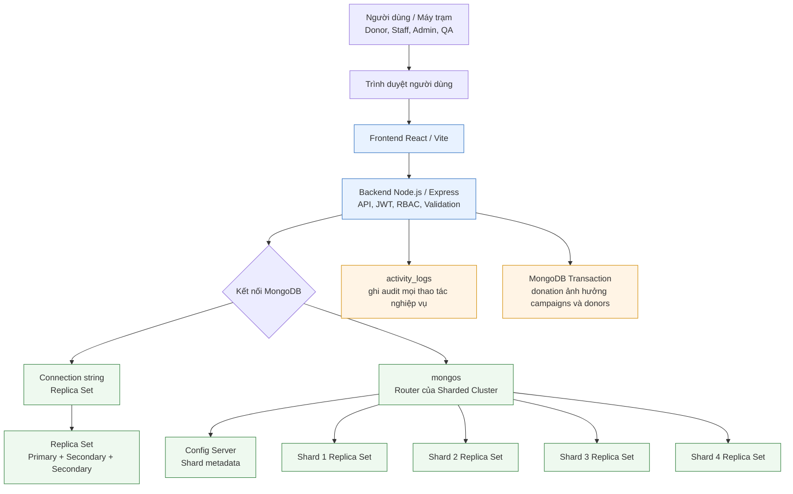

## Bản đồ chức năng và dữ liệu truy cập

**File:** `02_data_domain_map.mmd`

Dùng để giải thích nghiệp vụ nào đụng đến collection nào, đồng thời nhấn mạnh donations và activity_logs là vùng nóng.

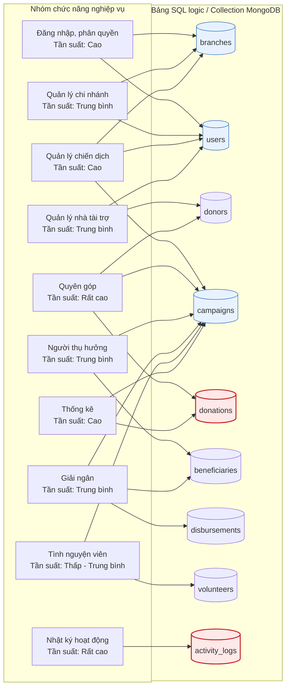

## ERD SQL logic đầy đủ

**File:** `03_sql_logic_erd.mmd`

Dùng làm sơ đồ quan trọng nhất trong báo cáo: bảng, khóa chính, khóa ngoại và quan hệ nghiệp vụ.

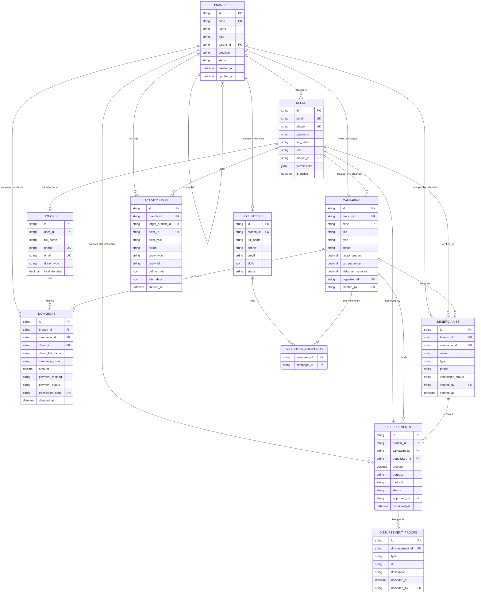

## Mô hình document MongoDB và dữ liệu nhúng

**File:** `04_mongodb_document_model.mmd`

Dùng để giải thích vì sao MongoDB phù hợp: snapshot trong donations, location/proofs nhúng trong document.

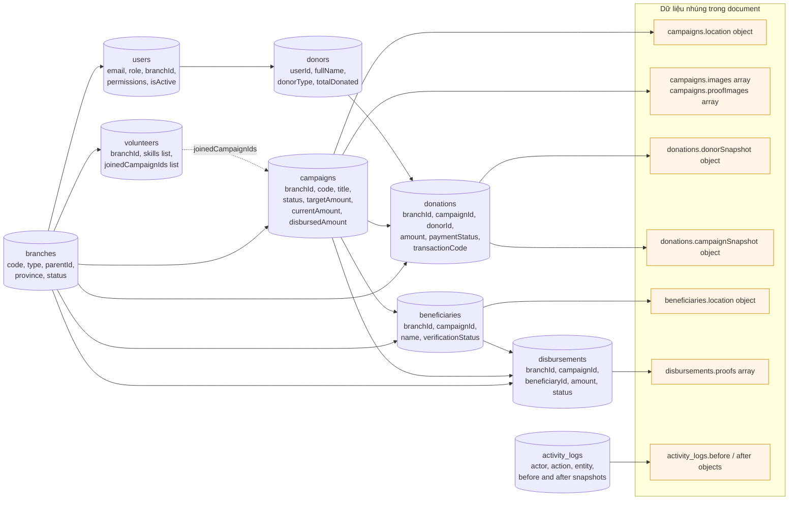

## Phân quyền RBAC và lọc dữ liệu theo chi nhánh

**File:** `05_rbac_branch_scope.mmd`

Dùng để trình bày cơ chế bảo vệ dữ liệu: JWT, role, branchId và ngoại lệ SUPER_ADMIN.

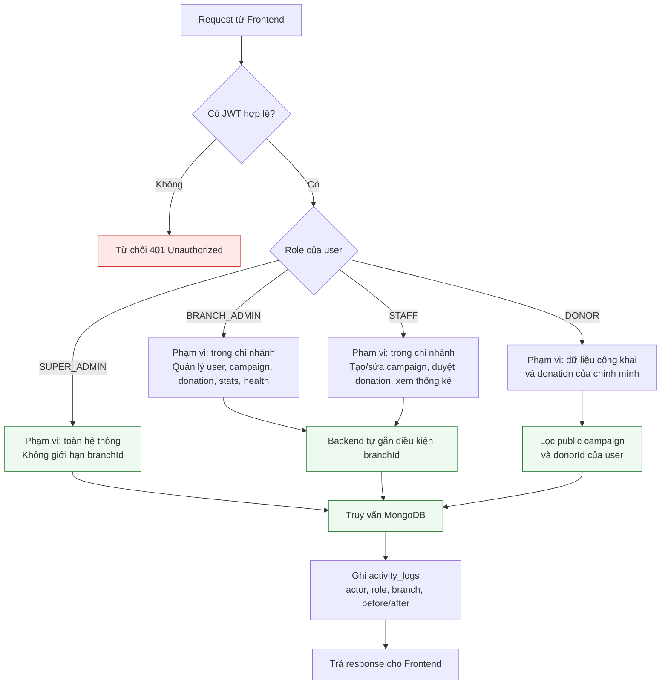

## Nhóm dữ liệu theo tần suất truy cập

**File:** `06_access_frequency_groups.mmd`

Dùng để giải thích nhanh bảng tần suất H/L, đọc/ghi/sửa/xóa ở trụ sở và chi nhánh.

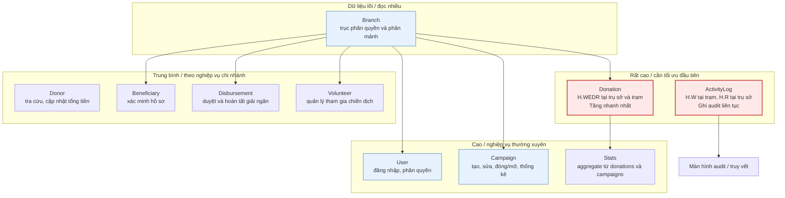

## Chiến lược chỉ mục dữ liệu

**File:** `07_index_strategy.mmd`

Dùng để trình bày các index quan trọng và use case: đăng nhập, lọc theo chi nhánh, thống kê donation, audit.

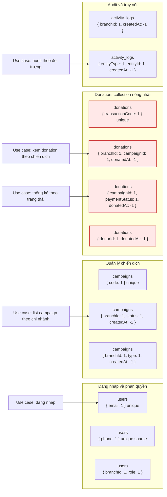

## Phân mảnh ngang dẫn xuất theo branchId

**File:** `08_horizontal_fragmentation_branchid.mmd`

Dùng cho phần thiết kế CSDL phân tán: branches là gốc, các collection nghiệp vụ phân mảnh theo chi nhánh.

```mermaid
%% 08_horizontal_fragmentation_branchid.mmd
flowchart TB
    GBranches[(branches toàn cục)] --> BR_HCM["BR_HCM<br/>branches.code = HCM"]
    GBranches --> BR_DNG["BR_DNG<br/>branches.code = DNG"]
    GBranches --> BR_HQ["BR_HQ<br/>branches.code = HQ"]
    GBranches --> BR_OTHER["BR_OTHER<br/>các chi nhánh còn lại"]

    BR_HCM --> CAM_HCM[(CAMPAIGNS_HCM)]
    BR_HCM --> DON_HCM[(DONATIONS_HCM)]
    BR_HCM --> BEN_HCM[(BENEFICIARIES_HCM)]
    BR_HCM --> DIS_HCM[(DISBURSEMENTS_HCM)]
    BR_HCM --> VOL_HCM[(VOLUNTEERS_HCM)]
    BR_HCM --> LOG_HCM[(LOGS_HCM)]

    BR_DNG --> CAM_DNG[(CAMPAIGNS_DNG)]
    BR_DNG --> DON_DNG[(DONATIONS_DNG)]
    BR_DNG --> BEN_DNG[(BENEFICIARIES_DNG)]
    BR_DNG --> DIS_DNG[(DISBURSEMENTS_DNG)]
    BR_DNG --> VOL_DNG[(VOLUNTEERS_DNG)]
    BR_DNG --> LOG_DNG[(LOGS_DNG)]

    BR_OTHER --> CAM_OTHER[(CAMPAIGNS_OTHER)]
    BR_OTHER --> DON_OTHER[(DONATIONS_OTHER)]
    BR_OTHER --> LOG_OTHER[(LOGS_OTHER)]

    Note["Nguyên tắc: mọi collection nghiệp vụ có branchId<br/>Backend lọc branchId; MongoDB shard/routing theo shard key"]
    Note -.-> DON_HCM
    Note -.-> DON_DNG
    Note -.-> DON_OTHER

    classDef root fill:#e8f2ff,stroke:#2f70c0,stroke-width:1px;
    classDef frag fill:#eef9ef,stroke:#2d7d3a,stroke-width:1px;
    class GBranches,BR_HCM,BR_DNG,BR_HQ,BR_OTHER root;
    class CAM_HCM,DON_HCM,BEN_HCM,DIS_HCM,VOL_HCM,LOG_HCM,CAM_DNG,DON_DNG,BEN_DNG,DIS_DNG,VOL_DNG,LOG_DNG,CAM_OTHER,DON_OTHER,LOG_OTHER frag;
```

## Định vị dữ liệu theo mô hình 6 máy

**File:** `09_six_machine_deployment.mmd`

Dùng cho phần cài đặt vật lý/định vị: máy 1 chạy ứng dụng và mongos, máy 2 trung tâm, máy 3-6 làm shard.

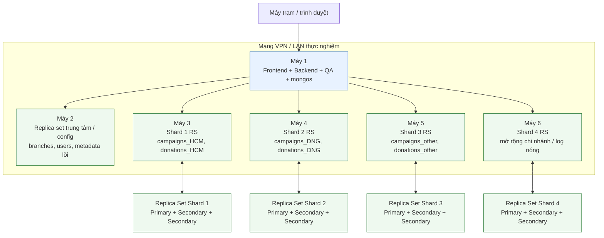

## Lược đồ ánh xạ Global Schema và Local Schema

**File:** `10_global_local_mapping.mmd`

Dùng để minh họa công thức union giữa fragment cục bộ và schema toàn cục trong môi trường phân tán.

```mermaid
%% 10_global_local_mapping.mmd
flowchart TB
    subgraph G["Global schema G"]
        GBranches[(branches)]
        GUsers[(users)]
        GDonors[(donors)]
        GCampaigns[(campaigns)]
        GDonations[(donations)]
        GBeneficiaries[(beneficiaries)]
        GDisbursements[(disbursements)]
        GVolunteers[(volunteers)]
        GLogs[(activity_logs)]
    end

    subgraph LHCM["Local schema L_HCM"]
        HCM_C[(campaigns_HCM)]
        HCM_D[(donations_HCM)]
        HCM_B[(beneficiaries_HCM)]
        HCM_DS[(disbursements_HCM)]
        HCM_V[(volunteers_HCM)]
        HCM_L[(logs_HCM)]
    end

    subgraph LDNG["Local schema L_DNG"]
        DNG_C[(campaigns_DNG)]
        DNG_D[(donations_DNG)]
        DNG_B[(beneficiaries_DNG)]
        DNG_DS[(disbursements_DNG)]
        DNG_V[(volunteers_DNG)]
        DNG_L[(logs_DNG)]
    end

    subgraph LOTHER["Local schema L_OTHER"]
        O_C[(campaigns_other)]
        O_D[(donations_other)]
        O_B[(beneficiaries_other)]
        O_DS[(disbursements_other)]
        O_V[(volunteers_other)]
        O_L[(logs_other)]
    end

    HCM_C --> U1["union"]
    DNG_C --> U1
    O_C --> U1
    U1 --> GCampaigns

    HCM_D --> U2["union"]
    DNG_D --> U2
    O_D --> U2
    U2 --> GDonations

    HCM_B --> U3["union"]
    DNG_B --> U3
    O_B --> U3
    U3 --> GBeneficiaries

    HCM_DS --> U4["union"]
    DNG_DS --> U4
    O_DS --> U4
    U4 --> GDisbursements

    HCM_L --> U5["union"]
    DNG_L --> U5
    O_L --> U5
    U5 --> GLogs

    MongoS["mongos tự ánh xạ<br/>dựa trên shard key và config metadata"] -.-> U1
    MongoS -.-> U2
    MongoS -.-> U5
```

## Nhân bản Replica Set và failover

**File:** `11_replication_failover.mmd`

Dùng để chứng minh đồng bộ dữ liệu, oplog replication và chuyển primary khi node lỗi.

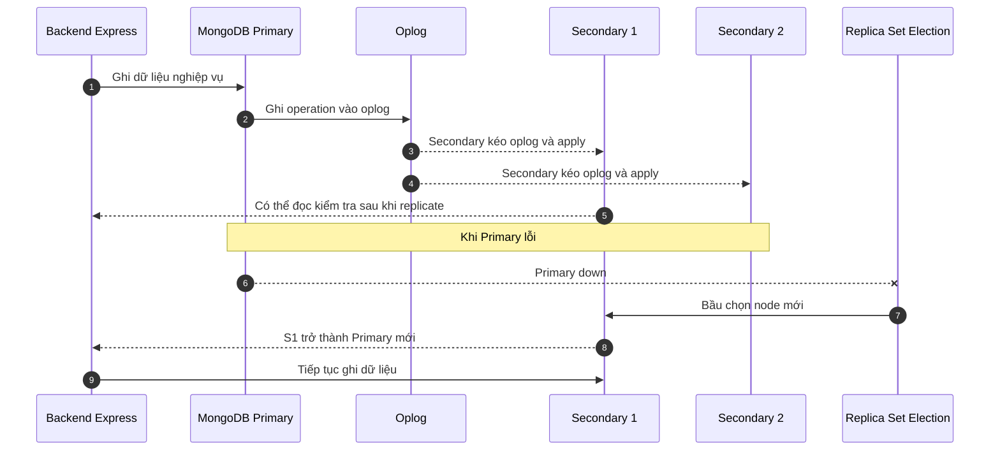

## Luồng giao tác tạo donation

**File:** `12_create_donation_sequence.mmd`

Dùng để trình bày transaction quan trọng nhất: insert donations, cập nhật campaigns.currentAmount, donors.totalDonated và ghi audit.

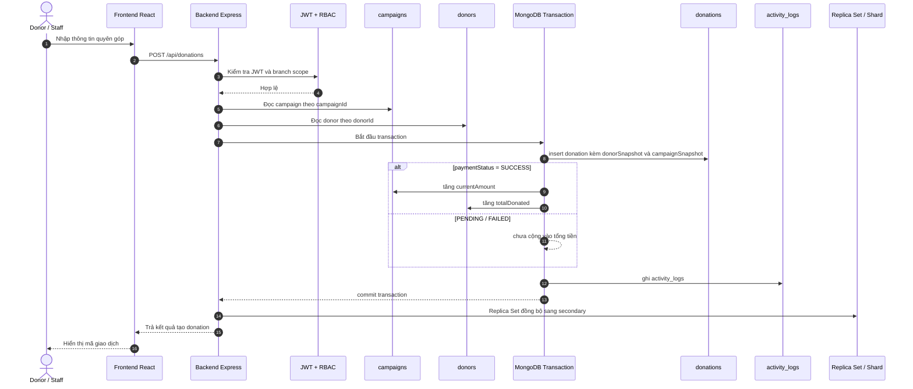

## Luồng cập nhật trạng thái donation

**File:** `13_update_donation_status_sequence.mmd`

Dùng để giải thích cách tính delta tiền khi PENDING/FAILED chuyển SUCCESS hoặc SUCCESS chuyển REFUNDED.

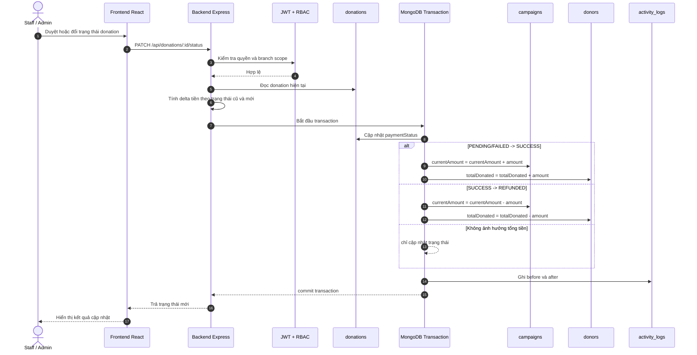

## Luồng thống kê dashboard

**File:** `14_statistics_aggregation_sequence.mmd`

Dùng để trình bày vì sao không cần lưu stats riêng: dùng aggregation từ donations và campaigns.

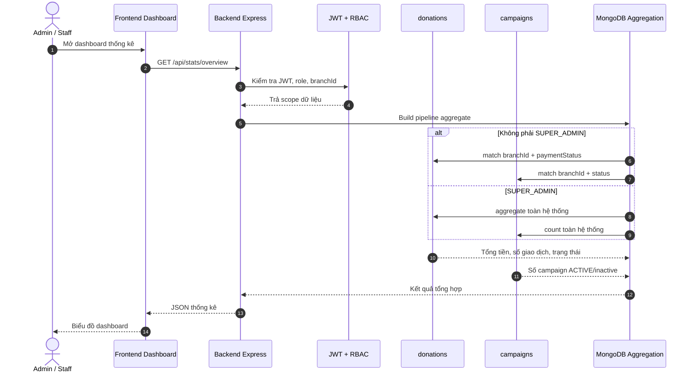

## Luồng ghi và truy vết activity_logs

**File:** `15_activity_log_audit_flow.mmd`

Dùng để nhấn mạnh audit không sửa/xóa thủ công, lưu actor, vai trò, branch, dữ liệu trước/sau.

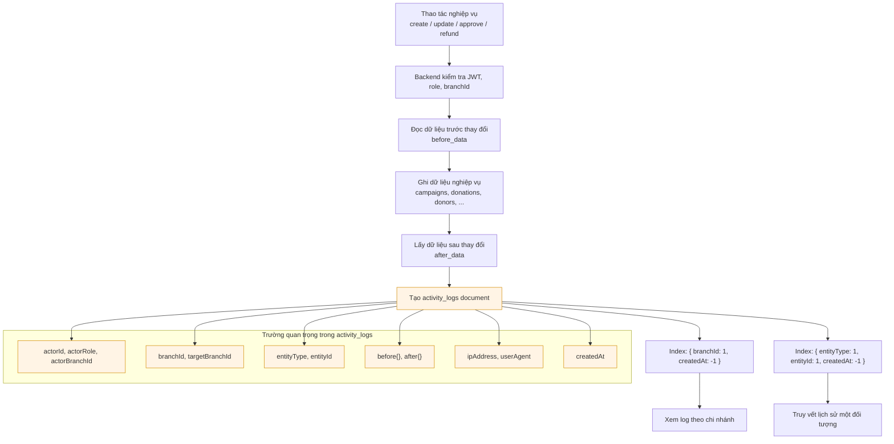

## Cây quyết định chọn shard key cho donations

**File:** `16_shard_key_decision.mmd`

Dùng để giải thích lựa chọn khuyến nghị: campaignId hashed vì đúng schema hiện tại.

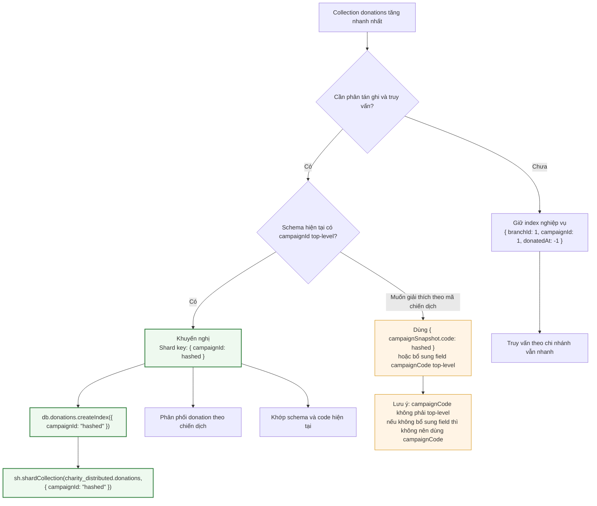

## Vòng đời trạng thái thanh toán donation

**File:** `17_donation_payment_state.mmd`

Dùng kèm hai sequence diagram để người xem hiểu tác động của từng trạng thái lên tổng tiền.

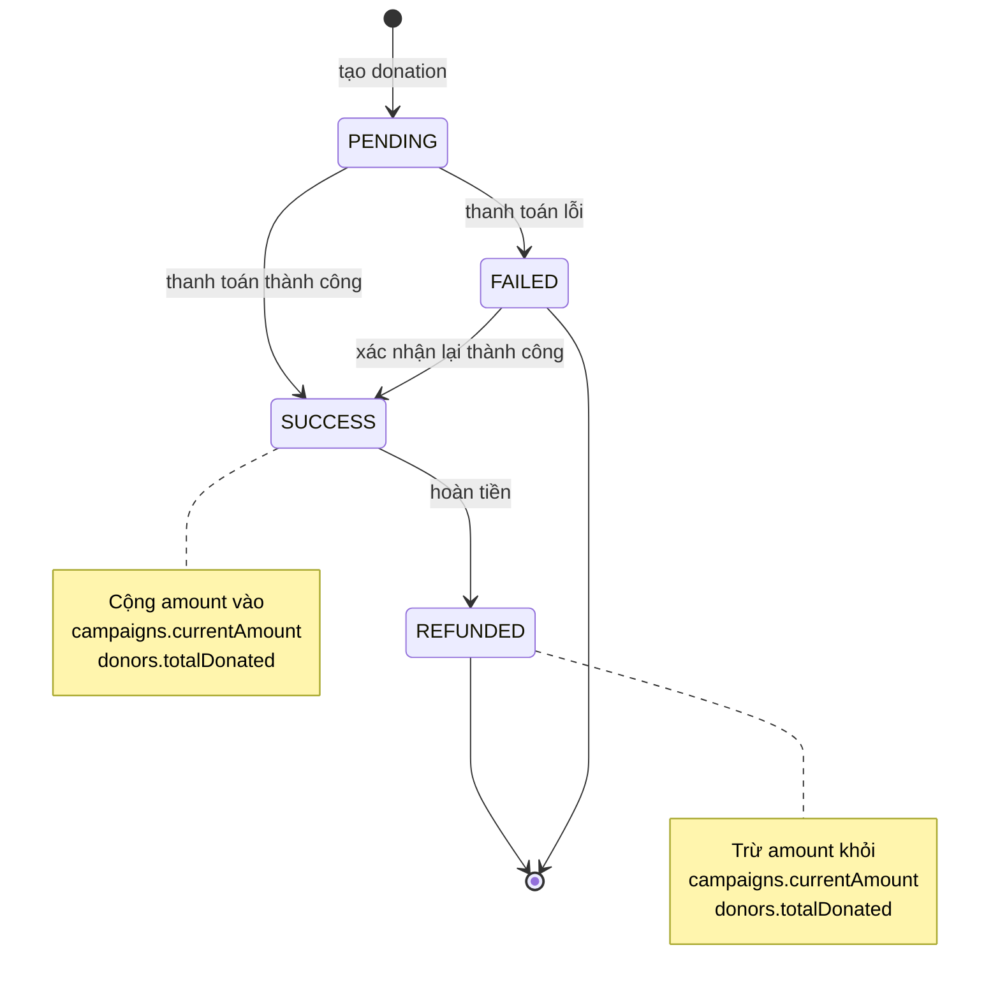

## Thứ tự trình bày sơ đồ trong báo cáo/thuyết trình

**File:** `18_report_slide_order.mmd`

Dùng như một sơ đồ dẫn chuyện để nhóm biết nên đưa hình nào trước, hình nào sau.

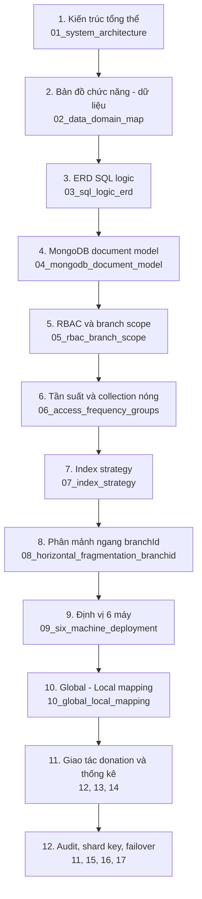

